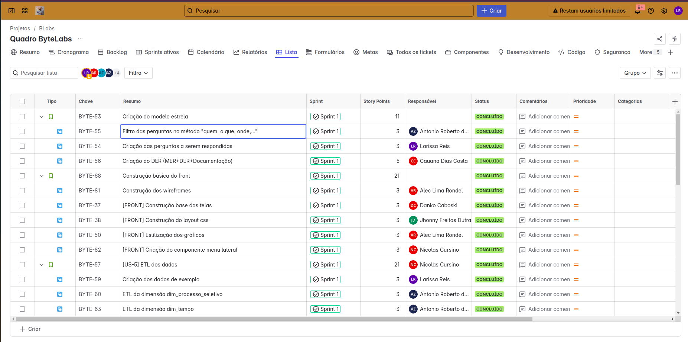
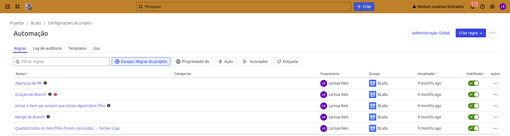
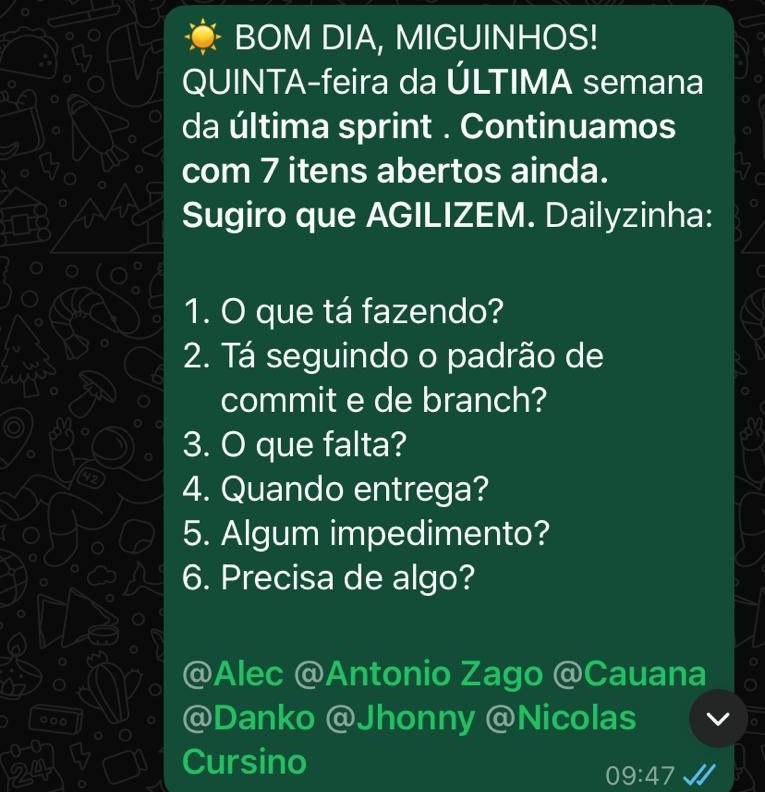
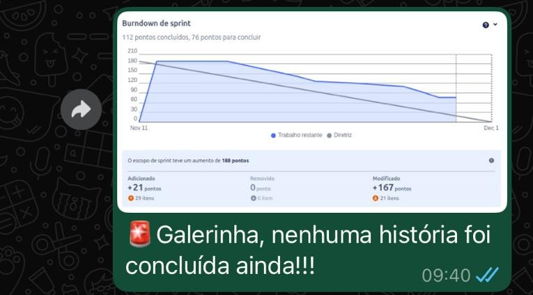
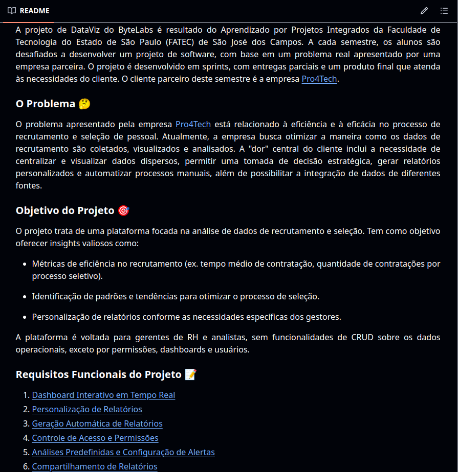
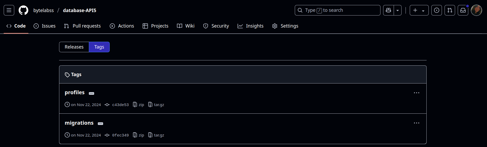

<h1 align="center">Portfólio das APIs - Larissa Reis</h1>
<h2>Introdução</h2>

Este portfólio foi criado com o intuito de apresentar os projetos desenvolvidos ao longo do curso de Banco de Dados na Faculdade de Tecnologia de São José dos Campos - Prof. Jessen Vidal.

<h2>Sumário</h2>

    <a href="#sobre_mim">Sobre mim</a></li> • 
    <a href="#contato">Contato</a> • 
    <a href="#projetos">Projetos</a>

<h2 id="sobre_mim">Sobre mim</h2>

    

    Concluí o Ensino Médio em 2018 e me vi diante do gigante desafio de escolher uma profissão.
    Sempre fui apaixonada por animais e, por muito tempo, pensei em seguir a carreira de veterinária, mas era economicamente inviável para mim.
    Então, após considerar várias opções, decidi estudar Python e lógica de programação no final da pandemia, o que me levou a descobrir o curso de Banco de Dados na FATEC como uma boa opção.
    Coincidentemente, as inscrições para o vestibular para o segundo semestre de 2022 da Faculdade estavam abertas. 
    Fiz a prova, passei e assim comecei minha jornada oficial na área de tecnologia.

    Ainda no 1° semestre do curso, tive a oportunidade de começar a estagiar como Engenheira de Dados na Quero Educação, EdTech brasileira responsável por diversos projetos, como por exemplo, o <a href="https://querobolsa.com.br/">Quero Bolsa</a>.
    Após 1 ano de estágio, fui efetivada, desenvolvendo ainda mais minhas habilidades em Engenharia de Dados, trabalhando com Python, SQL, Apache Spark, Apache Airflow e outras tecnologias.
    Durante esse período, tive a oportunidade de trabalhar em diversos projetos relevantes para a empresa e para meus colegas. 

    Atualmente, trabalho como Engenheira de Dados para a Zarp.AI, uma empresa de consultoria em banco de dados brasileira.
    Como Engenheira de Dados, sou responsável por manter pipelines de dados e desenvolver soluções para clientes, dentro ou fora da empresa.
    Para isso, utilizo tecnologias como Python, SQL, Pandas, Polars, Windmill, Supabase, Power BI, Metabase, entre outras. 

<h1 id="contato">Contato</h1>

    <a href="https://www.linkedin.com/in/larissa-reis-693568250">Linkedin</a> • 
    <a href="mailto:larireis.contato@gmail.com">Email</a> • 
    <a href="https://github.com/larissa-fernanda">GitHub</a>

<h1 id="projetos">Projetos</h1>
<ul>
    <li><a href="#api1">Projeto 1: Sistema de avaliação 360º</a></li>
    <li><a href="#api2">Projeto 2: Sistema de lançamento de horas-extras e sobreavisos desktop</a></li>
    <li><a href="#api3">Projeto 3: Sistema de lançamento de horas-extras e sobreavisos web</a></li>
    <li><a href="#api4">Projeto 4: Sistema de cadastro e atualização de parceiros</a></li>
    <li><a href="#api5">Projeto 5: Sistema de análise de dados de recrutamento e seleção de candidatos</a></li>
    <li><a href="#api6">Projeto 6: DataForest - Sistema de análise inteligente de reflorestamento de áreas</a></li>
</ul>

<h2 id="api1">Projeto 1: Sistema de avaliação 360º</h2>

<h3>Descrição</h3>

Desenvolvido no segundo semestre de 2022 (1° semestre do curso), este <a href="https://github.com/pontopython/api-bd1">projeto</a> teve como cliente a própria FATEC São José dos Campos. O objetivo era criar uma aplicação que permitisse que um time ágil de desenvolvimento dentro da instituição pudesse avaliar o desempenho de seus membros em um processo de avaliação 360º. A aplicação foi desenvolvida em Python, exclusivamente pelo terminal e sem banco de dados.

O sistema era composto por três categorias de usuários: adminitradores, instrutores e alunos. Além disso, o sistema era divido em turmas, que eram formadas por alunos e instrutores. Para cada turma, um instrutor poderia atuar como Fake Client ou como Group Leader. Dentro de uma mesma turma, os alunos eram divididos em times, que eram formados por um Líder Técnico, um Product Owner e membros do time.

Na hora da avaliação, um membro do time avaliava os outros membros, respondendo a cinco perguntas, cada uma com cinco opções de resposta. As respostas eram armazenadas em um arquivo de texto, permitindo a geração de relatórios com base nas avaliações realizadas. Um instrutor podia visualizar as avaliações de um aluno e gerar um relatório com as médias das avaliações. Além disso, um instrutor do tipo Fake Client tinha que avaliar seus alunos P.O. e um instrutor do tipo Group Leader tinha que avaliar seus alunos L.T.

<h3>Contribuições Individuais</h3>

Atuei como desenvolvedora full-stack. A seguir, estão listadas as minhas contribuições para o projeto:

<ul>
    

        
Desenvolvimento de funções para validação do nome de usuário e nome de time

        
Criei as funções iniciais de validação do nome de usuário e nome de time, garantindo que o nome informado pelo usuário atendesse aos critérios estabelecidos. As funções verificavam se o nome era válido, ou seja, se continha apenas letras e underlines, se não começava com números e se tinha mais de dois caracteres. Para isso, usei expressões regulares.

        <pre>
        <code>
        def has_name_valid_characters(name):
            "Verifica se tem caracteres especiais."
            return re.match("^[a-zA-Z0-9_-]+$", name)

        def is_name_valid(name, show=False):
            """
            Retorna True ou False. Verifica se o nome é valido ou não.
            Validações:
                - deve conter mais de 2 caracteres
                - não pode começar com número
                - não pode conter caracteres especiais, exceto underline "_"
            """
            if len(name) <= 2:
                if show == True:
                    print('O nome deve ter mais de 2 caracteres. Tente novamente!')
                return False
            elif not has_name_valid_characters(name):
                if show == True:
                    print('Formato inválido. Tente novamente!')
                return False
            elif re.match('\d', name[0]):
                if show == True:
                    print('Nomes não podem começar com número')
                return False
            else:
                return True

        def prompt_for_valid_username():
            """
            Loop pedindo para o usuário inserir o nome caso
            o nome seja inválido.
            """
            input_name = input('Digite o nome:')

            while not is_name_valid(input_name):
                input_name = input('Digite um nome válido:')

            return input_name

        def prompt_for_valid_team_name():
            input_team_name = input('Digite o nome do time: ')

            while not is_name_valid(input_team_name):
                input_team_name = input('Digite um nome válido para o time: ')

            return input_team_name

</code></pre> 
    

    

        
Desenvolvimento de funções para validação do email

        
Criei as funções iniciais de validação do email, garantindo que o email informado pelo usuário atendesse aos critérios estabelecidos. As funções verificavam se o email era válido, ou seja, se continha um "@" e um ".". Para isso, usei expressões regulares.

        <pre>
        <code>
        def is_email_valid(email):
            return re.match('^[a-z0-9.]+@[a-z0-9]+\.[a-z]+(\.[a-z]+)?$', email)

        def prompt_for_valid_email():
            input_email = input('Digite o email: ')

            while not is_email_valid(input_email):
                print('E-mail inválido. Digite novamente!')
                input_email = input('Digite o e-mail: ')

            return input_email
</code></pre>
    

    

        
Desenvolvimento de funções para validação da senha

        
Criei as funções iniciais de validação da senha, garantindo que a senha informada pelo usuário atendesse aos critérios estabelecidos. As funções verificavam se a senha era válida, ou seja, se continha pelo menos 8 caracteres, um número, uma letra maiúscula, uma letra minúscula e um caracter especial. Para isso, usei expressões regulares.

        <pre>
        <code>
        def is_password_valid(password, show=False):
            """
            Retorna True ou False. Verifica se a senha é valida ou não.
            Validações:
                - deve conter mais de 8 caracteres
                - deve conter pelo menos 1 letra maiúscula
                - deve conter pelo menos 1 letra minúscula
                - deve conter pelo menos 1 número
                - deve conter pelo menos 1 carácter especial (@!%*?&)    
            """
            if len(password) < 8:
                if show == True:
                    print('A senha deve ter mais de 8 caracteres.')
                return False
            elif not has_password_valid_characters(password):
                if show == True:
                    print('Formato inválido!')
                return False
            else:
                return True

        def prompt_for_valid_password(show = False):
            """
            Loop pedindo para o usuário inserir a senha caso
            ela seja inválida.
            """
            if show == True:
                print('Sua senha deve conter:\n- No mínimo 8 caracteres\n- No mínimo 1 letra maiúscula\n- No mínimo 1 letra minúscula\n- No mínimo 1 número\n- No mínimo 1 carácter especial (@!%*?&) ')
            input_password = stdiomask.getpass(prompt="Digite a senha: ", mask="*")

            while not is_password_valid(input_password, show):
                input_password = stdiomask.getpass(prompt="Digite uma senha válida: ", mask="*")

            return input_password
</code></pre>
    

    

        
Desenvolvimento de funções para criação do time

        
Criei as funções iniciais para a criação do time, permitindo que o usuário informasse o nome do time e os membros que fariam parte dele. As funções solicitavam ao usuário o nome do time e os dados dos membros, como nome, email e função. Os membros eram validados de acordo com as regras estabelecidas e, caso fossem válidos, eram adicionados ao time.

        
Os times eram formados por pelo menos um Líder Técnico e um Product Owner. Caso o time não atendesse a esses critérios, o usuário era informado e solicitado a informar os membros novamente. Ao informar um time válido, ele era salvo no arquivo de times.

        <pre>
        <code>
        def create_team_dict(id, team_name, members): #members = [{"nome": "nome do membro", "funcao": "funcao do membro"},...]
            return {
                "id": id,
                "team_name": team_name,
                "members": members
            }

        def prompt_for_team_members():
            members = []
            while True:
                with open('users.txt', 'r') as file:
                    category = prompt_for_valid_category()
                    name = prompt_for_valid_username()
                    email = prompt_for_valid_email()
                    member = None
                    for line in file:
                        user = line_to_user_dict(line)
                        if user["name"] == name and user["email"] == email and user["category"] == category:
                            member = {
                                "id" : user["id"],
                                "category": category,
                                "name": name,
                                "email": email,
                            }
                            members.append(member)
                            break
                    if not member:
                        print('Usuário não encontrado.')

                    asking = input('Deseja continuar?').lower()
                    if asking == 'n'or asking == 'nao' or asking == 'não':
                        break
            return members

        def create_team_interactively():
            print("\nFormulário de Criação de Time\n")

            team_name = prompt_for_valid_team_name()
            members = prompt_for_team_members()
            if not has_team_valid_members(members):
                print("O time precisa ter pelo menos um Líder técnico e um Product Owner")
                return create_team_interactively()
            team_dict = create_team_dict(uuid.uuid4(), team_name, members)
            save_team_to_file(team_dict)

        def has_team_valid_members(members):
            """
            Verifica se o time tem pelo menos 1 Líder Técnico e 1 PO
            """
            needed_categories = set(['LT', 'PO'])
            category_of_members = set([member['category'] for member in members])
            return needed_categories.issubset(category_of_members)

        def save_team_to_file(team):
            file = open("data/teams.txt", "a")
            line = team_dict_to_line(team)
            file.write(line)
            file.write("\n")
            file.close()
            print("Time salvo com sucesso!")

        def print_team_members(team_name):
            found_team = None
            with open('data/teams.txt', 'r') as file:
                for line in file:
                    team_dict = line_to_team_dict(line.rstrip())

                    if team_name == team_dict["team_name"]:
                        found_team = team_dict
                        break

                if not found_team:
                    print("Time não encontrado")
                    return

            members = []

            with open("data/users.txt", "r") as file:
                for line in file:
                    user_dict = line_to_user_dict(line)
                    if user_dict["id"] in found_team["members_id"]:
                        members.append({**user_dict, "password": "****"})

            print("Time: ", found_team["team_name"])
            for member in members:
                print(member["name"], member["category"])

        def team_dict_to_line(team):
            team_id = team["id"]
            team_name = team["team_name"]
            members = [member["id"] for member in team["members"]]
            members_id = ','.join(members)
            return f"{team_id};{team_name};{members_id}"

        def line_to_team_dict(line):
            splited_line = line.split(";")
            team_id = splited_line[0]
            team_name = splited_line[1]
            members_id = splited_line[2].split(',')
            team_dict = {
                "team_id": team_id,
                "team_name": team_name,
                "members_id": members_id
            }
            return team_dict
</code></pre>
    

    

        
Desenvolvimento da lógica para a avaliação 360º

        
Criei a lógica para a avaliação 360º, permitindo que um membro do time avaliasse os outros membros. A avaliação era composta por cinco perguntas, cada uma com cinco opções de resposta. As respostas eram armazenadas em um arquivo de texto, permitindo a geração de relatórios com base nas avaliações realizadas.

        
Como o sistema era composto por diferentes categorias de usuários, um instrutor 
        <pre>
        <code>
        categories = {
            'PO': 'Product Owner',
            'LT': 'Líder Técnico',
            'MT':  'Membro do time',
        }

        def search_teams_on_file_by_user(user,select_member=True, show=True):
            teams = []
            with open('data/teams.txt', "r") as file:
                for line in file:
                    team = line_to_team_dict(line)
                    if user in team["members"]:
                        teams.append(team)

            if show:
                if len(teams) > 0:
                    blue_bright_print('\n          Seus times:') 
                    for indice, team in enumerate(teams):
                        print(f'     {indice+1}. {team["name"]}')

                    input_team = int(bright_input('\nQual time deseja selecionar? '))

                    if input_team > 0 and input_team <= len(teams):
                        team = teams[input_team - 1]
                        if select_member:
                            return select_team_member(user, team), team['id']
                        else:
                            return None, team['id']

                    else:
                        red_print('\nOpção inválida. Tente novamente!\n')
                        return search_teams_on_file_by_user(user, select_member)
                else:
                    green_print('Você não está inserido em nenhum time ainda.')
                    return None
            else:
                return teams

        def select_team_member(user ,team):
            print()
            blue_bright_print(f'     Membros de {team["name"]}:')
            valid_members = []
            for member in team['members']:
                if user['category'] == 'PO' or user['category'] == 'LT' or user['category'] == 'MT':
                    if member['category'] == 'PO' or member['category'] == 'LT' or member['category'] == 'MT':
                        valid_members.append(member)
                elif user['category'] == 'LG':
                    if member['category'] == 'LT':
                        valid_members.append(member)
                elif user['category'] == 'FC':
                    if member['category'] == 'PO':
                        valid_members.append(member)
            for indice, member in enumerate(valid_members):
                print(f'{indice+1}. {categories[member["category"]].ljust(20," ")}{member["name"]}')

            input_member = int(bright_input('\nQual membro deseja avaliar? '))
            if input_member > 0 and input_member <= len(valid_members):
                return valid_members[input_member-1]

            else:
                red_print('Usuário inválido. Tente novamente!')
                return select_team_member(team)

        def evaluation_form(user=None, team=None, show=True):
            questions = {
                '1': {
                    'question': "Trabalho em equipe, cooperação e descentralização de conhecimento:",
                    'answers': {'0': 'Muito Ruim', '1': 'Ruim', '2': 'Regular', '3': 'Bom', '4': 'Muito Bom'},
                },
                '2': {
                    'question': "Iniciativa e proatividade:",
                    'answers': {'0': 'Muito Ruim', '1': 'Ruim', '2': 'Regular', '3': 'Bom', '4': 'Muito Bom'},
                },
                '3': {
                    'question': "Autodidaxia e agregação de conhecimento ao grupo:",
                    'answers': {'0': 'Muito Ruim', '1': 'Ruim', '2': 'Regular', '3': 'Bom', '4': 'Muito Bom'},
                },
                '4': {
                    'question': "Entrega de resultados e participação efetiva no projeto:",
                    'answers': {'0': 'Muito Ruim', '1': 'Ruim', '2': 'Regular', '3': 'Bom', '4': 'Muito Bom'},
                },
                '5': {
                    'question': "Competência técnica:",
                    'answers': {'0': 'Muito Ruim', '1': 'Ruim', '2': 'Regular', '3': 'Bom', '4': 'Muito Bom'},
                }
            }
            if show:
                blue_bright_print(f"\n           Avaliação de {user['name']}\n")
                lista = []
                for qk, qv in questions.items():
                    green_print(f'\n{qk}. {qv["question"]}')

                    print('\nEscolha entre as opções indicadas:\n')
                    for ak, av in qv['answers'].items():
                        print(f'[{ak}]: {av}')

                    answers_user = int(bright_input('\nOpção: '))
                    print()
                    while answers_user < 0 or answers_user > 4:
                        red_print('\nOpção inválida! Tente novamente.\n')
                        answers_user = int(bright_input('\nOpção: '))
                    lista.append(answers_user)

                return evaluation(lista, user, team)

            else:
                return questions

        def evaluation(lista, user, team):
            evaluation = {'skill_1': lista[0], 'skill_2':lista[1], 'skill_3':lista[2], 'skill_4':lista[3], 'skill_5':lista[4]}
            id_sprint = 1
            id_team = team
            id_user_log = get_logged_user()['id']
            category_user_log = get_logged_user()['category']
            id_av_user = user['id']
            category_av_user = user['category']
            name_av_user = user['name']
            skill_1 = evaluation["skill_1"]
            skill_2 = evaluation["skill_2"]
            skill_3 = evaluation["skill_3"]
            skill_4 = evaluation["skill_4"]
            skill_5 = evaluation["skill_5"]

            line = f"{id_sprint};{id_team};{id_user_log};{category_user_log};{id_av_user};{category_av_user};{name_av_user};{skill_1};{skill_2};{skill_3};{skill_4};{skill_5}"

            return save_evaluation(line)

        def save_evaluation(line):
            file = open('data/evaluations.txt', "a")
            file.write(line)
            file.write("\n")
            file.close()

        def line_to_evaluation_dict(line):
            splitted_line = line.rstrip("\n").split(";")
            id_sprint = splitted_line[0]
            id_team = splitted_line[1]
            id_user_log = splitted_line[2]
            category_user_log = splitted_line[3]
            id_av_user = splitted_line[4]
            category_av_user = splitted_line[5]
            name_av_user = splitted_line[6]
            skill_1 = splitted_line[7]
            skill_2 = splitted_line[8]
            skill_3 = splitted_line[9]
            skill_4 = splitted_line[10]
            skill_5 = splitted_line[11]
            dict = {
                    "id_sprint": id_sprint,
                    "id_team": id_team,
                    "id_user_log": id_user_log,
                    "category_user_log": category_user_log,
                    "id_av_user": id_av_user,
                    "category_av_user": category_av_user,
                    "name_av_user": name_av_user,
                    "skill_1": skill_1,
                    "skill_2": skill_2,
                    "skill_3": skill_3,
                    "skill_4": skill_4,
                    "skill_5": skill_5 
                    }
            return dict

        def mean_grades(team, user):
            skills = [[],[],[],[],[]]

            with open ('data/evaluations.txt', "r") as file:
                for line in file:
                    splitted_line = line.rstrip("\n").split(";")
                    if team == splitted_line[1] and user == splitted_line[4]:
                        skills[0].append(int(splitted_line[7]))
                        skills[1].append(int(splitted_line[8]))
                        skills[2].append(int(splitted_line[9]))
                        skills[3].append(int(splitted_line[10]))
                        skills[4].append(int(splitted_line[11]))

            if len(skills[0]) > 0:    
                mean = [
                    round(statistics.mean(skills[0]), 1),
                    round(statistics.mean(skills[1]), 1),
                    round(statistics.mean(skills[2]), 1),
                    round(statistics.mean(skills[3]), 1),
                    round(statistics.mean(skills[4]), 1),
                ]

                total_mean = round(statistics.mean(mean), 1)

                return [mean, total_mean]
            else:
                return None

        def print_mean_grades(team, user):
            mean = mean_grades(team,user['id'])
            questions = evaluation_form(user, team, show=False)

            if mean is None:
                magenta_print('\nVocê ainda não foi avaliado.')
                return

            blue_bright_print(f"\n          Médias de {user['name']}\n")    
            for n, question in enumerate(questions):
                bright_print(f'{questions[question]["question"]}')
                if mean[0][n] > 2:
                    green_print(f'{mean[0][n]}')
                elif mean[0][n] == 2:
                    magenta_print(f'{mean[0][n]}')
                else:
                    red_print(f'{mean[0][n]}')
            if mean[1] >= 2:
                green_print(f'\nMédia total: {mean[1]}\n')
            elif mean[1] == 2:
                magenta_print(f'\nMédia total: {mean[1]}\n')
            else:
                red_print(f'\nMédia total: {mean[1]}\n')

        def print_mean_grades_LG(team_id, LT = False):
            with open('data/teams.txt', 'r') as file:
                for line in file:
                    team_dict = line_to_team_dict(line)
                    if team_id == team_dict['id']:
                        team = team_dict
                        break

            team_member_mean = {member['id']: {'name': member['name'], 'category': member['category']} for member in team['members']}

            with open ('data/evaluations.txt', "r") as file:
                for line in file:
                    dict_line = line_to_evaluation_dict(line)
                    if team_id == dict_line['id_team']:
                        if team_member_mean[dict_line['id_av_user']].get('mean', None) is None:
                            member_mean = mean_grades(team_id, dict_line['id_av_user'])
                            team_member_mean[dict_line['id_av_user']]['mean'] = member_mean

            questions = evaluation_form(show=False)
            members_to_list = team_member_mean

            if LT:
                members_to_list = {id: item for id, item in team_member_mean.items() if item['category'] == 'LT'}
            for item in members_to_list.values():
                if 'mean' not in item:
                    if item['category'] not in ['FC', 'LG']:
                        magenta_print(f'\n{item["name"]} ({categories[item["category"]]}) ainda não foi avaliado.')
                    continue
                blue_bright_print(f"\n          Médias de {item['name']} - {categories[item['category']]}\n")
                for n, question in enumerate(questions):
                    bright_print(f'{questions[question]["question"]}', end = ' ')
                    if item["mean"][0][n] > 2:
                        green_print(f'{item["mean"][0][n]}')
                    elif item["mean"][0][n] == 2:
                        magenta_print(f'{item["mean"][0][n]}')
                    else:
                        red_print(f'{item["mean"][0][n]}')
                if item["mean"][1] >= 2:
                    green_print(f'\nMédia total: {item["mean"][1]}\n')
                elif item["mean"][1] == 2:
                    magenta_print(f'\nMédia total: {item["mean"][1]}\n')
                else:
                    red_print(f'\nMédia total: {item["mean"][1]}\n')

        def print_mean_grades_FC(team):
            lista = []
            with open ('data/evaluations.txt', "r") as file:
                for line in file:
                    dict_line = line_to_evaluation_dict(line)
                    if team == dict_line['id_team']:
                        if dict_line['category_av_user'] == 'PO':
                            if dict_line['id_av_user'] not in [item[0] for item in lista]:
                                po_mean = mean_grades(team, dict_line['id_av_user'])
                                lista.append((dict_line['id_av_user'], dict_line['name_av_user'], po_mean))

            if len(lista) < 1:
                magenta_print('\nO PO desse time ainda não foi avaliado.')

            questions = evaluation_form(show=False)
            for item in lista:
                blue_bright_print(f"\n          Médias de {item[1]}\n")    
                for n, question in enumerate(questions):
                    bright_print(f'{questions[question]["question"]}', end = ' ')
                    if item[2][0][n] > 2:
                        green_print(f'{item[2][0][n]}')
                    elif item[2][0][n] == 2:
                        magenta_print(f'{item[2][0][n]}')
                    else:
                        red_print(f'{item[2][0][n]}')
                if item[2][1] >= 2:
                    green_print(f'\nMédia total: {item[2][1]}\n')
                elif item[2][1] == 2:
                    magenta_print(f'\nMédia total: {item[2][1]}\n')
                else:
                    red_print(f'\nMédia total: {item[2][1]}\n')

        def run_evaluation():
            user_log = get_logged_user()
            if user_log['category']!= 'LG' and user_log['category']!= 'FC':
                av_user, id_team = search_teams_on_file_by_user(user_log)
                evaluation_form(av_user, id_team)
            elif user_log['category'] == 'LG':
                av_user, id_team = search_teams_on_file_by_user(user_log)
                evaluation_form(av_user, id_team)
            else:
                av_user, id_team = search_teams_on_file_by_user(user_log)
                evaluation_form(av_user, id_team)

        def run_mean_grades():
            user_log = get_logged_user()

            if user_log['category']!= 'LG' and user_log['category']!= 'FC':
                av_user, id_team = search_teams_on_file_by_user(user_log, select_member=False)
                print_mean_grades(id_team, user_log)

            elif user_log['category'] == 'LG':
                av_user, id_team = search_teams_on_file_by_user(user_log, select_member=False)
                only_LT = ['Ver somente as médias dos Líderes Técnicos', 'Ver as notas de todo o time']
                blue_bright_print('\n       Selecione uma opção:'.center(60))
                for indice, item in enumerate(only_LT):
                    print(f'     {indice+1}. {item}')
                awnser = int(input('\n   Opção: '))
                while awnser != 1 and awnser != 2:
                    awnser = int(input('\n   Opção: '))
                if awnser == 1:
                    print_mean_grades_LG(id_team, LT=True)
                elif awnser == 2:
                    print_mean_grades_LG(id_team)

            elif user_log['category'] == 'FC':   
                av_user, id_team = search_teams_on_file_by_user(user_log, select_member=False)
                print_mean_grades_FC(id_team)
</pre></code>
    

    

        
Desenvolvimento da lógica de sprints

        
Criei a lógica para a criação e fechamento de sprints, permitindo que um instrutor do tipo Group Leader pudesse criar uma sprint e fechá-la. Além disso, criei a lógica para a seleção de uma sprint, permitindo que um instrutor pudesse selecionar uma sprint para avaliar os membros do time

        
Para a criação de uma sprint, era necessário fechar a sprint anterior, caso houvesse uma sprint aberta. Para isso, criei a função <code>get_opened_sprint</code>, que retornava a sprint aberta, caso houvesse uma, e a função <code>has_opened_sprint</code>, que verificava se havia uma sprint aberta. Além disso, criei a função <code>select_sprint_tui</code>, que permitia a seleção de uma sprint, e a função <code>close_sprint_tui</code>, que fechava a sprint selecionada.

        
A criação de uma sprint se dava por turma, ou seja, um instrutor do tipo Group Leader podia criar uma sprint para uma turma específico.

        <pre>
        <code>
        def summary_sprint(sprint):
            name = sprint["name"]
            id = sprint["id"]
            status = sprint["status"]
            return f"{name} #{id} ({status})"

        def show_sprints_from_group(group):
            sprints = get_all_sprints_from_group(group)
            print("Sprints")
            for sprint in sprints:
                print(f"    - {summary_sprint(sprint)}")

        def has_group_opened_sprint(group):
            opened_sprints = get_opened_sprint_from_group(group)
            return opened_sprints is not None

        def open_sprint_for_group(group):
            if has_group_opened_sprint(group):
                print("Já existe uma sprint aberta.")
                return
            sprint_name = input('Qual o nome da sprint? ')
            create_sprint(group, sprint_name)

        def close_sprint_from_group(group):
            if not has_group_opened_sprint(group):
                print("Não existe sprint aberta.")
                return
            sprint = get_opened_sprint_from_group(group)
            print(summary_sprint(sprint))
            answer = input("Tem certeza que deseja fechar essa sprint (S/N)? ")
            if answer != "S" and answer != "s":
                return
            sprint["status"] = "fechada"
            update_sprints()    

        def select_sprint_from_group(group, closed=False):
            sprints = get_all_sprints_from_group(group)
            if not closed:
                valid_sprints = sprints
            if closed:
                valid_sprints = []
                for sprint in sprints:
                    if sprint['status'] == 'fechada':
                        valid_sprints.append(sprint)

            if len(valid_sprints) == 0:
                print("Nenhuma sprint encontrada.")
                return None

            for index, sprint in enumerate(valid_sprints):
                print(f"{index+1} - {summary_sprint(sprint)}")

            while True:
                option = safe_int_input("Opção: ")
                if option > 0 and option <= len(sprints):
                    return valid_sprints[option - 1]
                print("Opção inválida.")

        def reopen_sprint_from_group(group):
            if has_group_opened_sprint(group):
                print("Já existe uma sprint aberta.")
                return
            sprint = select_sprint_from_group(group)

            if sprint is None:
                return
            
            print(summary_sprint(sprint))
            answer = input("Tem certeza que deseja reabrir essa sprint (S/N)? ")
            if answer != "S" and answer != "s":
                return
            sprint["status"] = "aberta"
            update_sprints()    

        def admin_sprints_menu():
            print("Selecione a Turma")
            turma = search_and_select_turma()
            if turma is None:
                return
            
            while True:
                print("Menu Sprints (Administrador)")
                print(f"Turma: {turma['name']}")
                print("1 - Listar")
                print("2 - Abrir Nova")
                print("3 - Fechar")
                print("4 - Reabrir")
                print("5 - Voltar")
                
                while True:
                    option = safe_int_input("Opção: ")
                    if option >= 1 and option <= 6:
                        break
                    print("Opção inválida.")
                
                if option == 1:
                    show_sprints_from_group(turma)
                elif option == 2:
                    open_sprint_for_group(turma)
                elif option == 3:
                    close_sprint_from_group(turma)
                elif option == 4:
                    reopen_sprint_from_group(turma)
                else:
                    return
</code></pre>
    

    

        
Desenvolvimento da lógica de geração de relatórios

        
Criei a lógica para a geração de relatórios, permitindo que o administrador pudesse ver todas as médias no geral ou por sprint, um aluno pudesse ver todas as suas médias no geral ou por sprint, um instrutor do tipo Group Leader pudesse ver as médias de todos os membros do time ou somente dos Líderes Técnicos e um instrutor do tipo Fake Client pudesse ver somente as médias dos Product Owners.

        <pre>
        <code>
        EVALUATIONS_TXT_FILE =  "data/evaluations.txt"

        CATEGORIES = {
            "PRODU": "Product Owner",
            "LIDER": "Líder Técnico",
            "COMUM": "Membro do time",
        }

        def average_grades(team_id, user_id, sprint=None):
            skills = [[], [], [], [], []]

            with open(EVALUATIONS_TXT_FILE, "r") as file:
                for line in file:
                    evaluation = line_to_evaluation_dict(line)
                    if sprint is not None:
                        if team_id == evaluation["id_team"] and user_id == evaluation["evaluated_id"] and sprint['id'] == evaluation['id_sprint']:
                            skills[0].append(int(evaluation["skill_1"]))
                            skills[1].append(int(evaluation["skill_2"]))
                            skills[2].append(int(evaluation["skill_3"]))
                            skills[3].append(int(evaluation["skill_4"]))
                            skills[4].append(int(evaluation["skill_5"]))
                    else:
                        if team_id == evaluation["id_team"] and user_id == evaluation["evaluated_id"]:
                            skills[0].append(int(evaluation["skill_1"]))
                            skills[1].append(int(evaluation["skill_2"]))
                            skills[2].append(int(evaluation["skill_3"]))
                            skills[3].append(int(evaluation["skill_4"]))
                            skills[4].append(int(evaluation["skill_5"]))

            if len(skills[0]) > 0:
                mean = [
                    round(statistics.mean(skills[0]), 1),
                    round(statistics.mean(skills[1]), 1),
                    round(statistics.mean(skills[2]), 1),
                    round(statistics.mean(skills[3]), 1),
                    round(statistics.mean(skills[4]), 1),
                ]

                total_mean = round(statistics.mean(mean), 1)

                return [mean, total_mean]
            else:
                return None

        def print_average_grades(team, user, sprint=None):
            average = average_grades(team['id'], user["id"], sprint)
            questions = evaluation_form(show=False)

            if average is None:
                magenta_print("\nVocê ainda não foi avaliado.")
                return

            blue_bright_print(f"\n          Médias de {user['name']}\n")
            for n, question in enumerate(questions):
                bright_print(f'{questions[question]["question"]}')
                if average[0][n] > 2:
                    green_print(f"{average[0][n]}")
                elif average[0][n] == 2:
                    magenta_print(f"{average[0][n]}")
                else:
                    red_print(f"{average[0][n]}")
            if average[1] >= 2:
                green_print(f"\nMédia total: {average[1]}\n")
            elif average[1] == 2:
                magenta_print(f"\nMédia total: {average[1]}\n")
            else:
                red_print(f"\nMédia total: {average[1]}\n")

        def print_average_grades_LG(team, sprint=None, LT=False):

            team_member_average = {
                member["id"]: {"name": member["name"], "category": member["category"]}
                for member in team["members"]
            }

            with open(EVALUATIONS_TXT_FILE, "r") as file:
                for line in file:
                    dict_line = line_to_evaluation_dict(line)
                    if team['id'] == dict_line["id_team"]:
                        if team_member_average[dict_line["evaluated_id"]].get("average", None) is None:
                            member_average = average_grades(team['id'], dict_line["evaluated_id"], sprint)
                            team_member_average[dict_line["evaluated_id"]]["average"] = member_average

            questions = evaluation_form(show=False)
            members_to_list = team_member_average

            if LT:
                members_to_list = {
                    id: item
                    for id, item in team_member_average.items()
                    if item["category"] == "LIDER"
                }
            for item in members_to_list.values():
                if "average" not in item:
                    magenta_print(
                        f'\n{item["name"]} ({CATEGORIES[item["category"]]}) ainda não foi avaliado.'
                    )
                    continue
                blue_bright_print(
                    f"\n          Médias de {item['name']} - {CATEGORIES[item['category']]}\n"
                )
                for n, question in enumerate(questions):
                    bright_print(f'{questions[question]["question"]}', end=" ")
                    if item["average"][0][n] > 2:
                        green_print(f'{item["average"][0][n]}')
                    elif item["average"][0][n] == 2:
                        magenta_print(f'{item["average"][0][n]}')
                    else:
                        red_print(f'{item["average"][0][n]}')
                if item["average"][1] >= 2:
                    green_print(f'\nMédia total: {item["average"][1]}\n')
                elif item["average"][1] == 2:
                    magenta_print(f'\nMédia total: {item["average"][1]}\n')
                else:
                    red_print(f'\nMédia total: {item["average"][1]}\n')

        def print_average_grades_FC(team, sprint):
            lista = []
            with open(EVALUATIONS_TXT_FILE, "r") as file:
                for line in file:
                    dict_line = line_to_evaluation_dict(line)
                    if team["id"] == dict_line["id_team"]:
                        if dict_line["evaluated_category"] == "PRODU":
                            if dict_line["evaluated_id"] not in [item[0] for item in lista]:
                                po_average = average_grades(team["id"], dict_line["evaluated_id"], sprint)
                                lista.append(
                                    (
                                        dict_line["evaluated_id"],
                                        dict_line["evaluated_name"],
                                        po_average,
                                    )
                                )

            if len(lista) < 1:
                magenta_print("\nO Product Owner desse time ainda não foi avaliado.")

            questions = evaluation_form(show=False)
            for item in lista:
                blue_bright_print(f"\n          Médias de {item[1]}\n")
                for n, question in enumerate(questions):
                    bright_print(f'{questions[question]["question"]}', end=" ")
                    if item[2][0][n] > 2:
                        green_print(f"{item[2][0][n]}")
                    elif item[2][0][n] == 2:
                        magenta_print(f"{item[2][0][n]}")
                    else:
                        red_print(f"{item[2][0][n]}")
                if item[2][1] >= 2:
                    green_print(f"\nMédia total: {item[2][1]}\n")
                elif item[2][1] == 2:
                    magenta_print(f"\nMédia total: {item[2][1]}\n")
                else:
                    red_print(f"\nMédia total: {item[2][1]}\n")

        def by_sprint_question(team):
            by_sprint = [
                "Ver as médias por sprint",
                "Ver as médias de todas as sprints"
            ]
            blue_bright_print("\n       Ver médias por sprint?".center(60))

            for indice, item in enumerate(by_sprint):
                print(f"     {indice+1}. {item}")
            awnser_sprint = int(bright_input("\n   Opção: "))

            while awnser_sprint != 1 and awnser_sprint != 2:
                awnser_sprint = int(bright_input("\n   Opção: "))

            if awnser_sprint == 1:
                sprint = select_sprint_tui(team['id'], closed=True)

            elif awnser_sprint == 2:
                sprint = None

            return sprint

        def run_average_grades():
            user, groups = search_groups()
            av_user, team = select_group(user, groups, select_member=False)
            sprint = by_sprint_question(team)

            if user["type"] == 'COMUM':
                print_average_grades(team, user, sprint)

            elif user["type"] == 'ADMIN':
                print_average_grades_LG(team, sprint)

            elif user["id"] == team['turma']['group_leader']['id']:
                only_LT = [
                    "Ver somente as médias dos Líderes Técnicos",
                    "Ver as notas de todo o time",
                ]
                blue_bright_print("\n       Quais médias quer ver?".center(60))
                for indice, item in enumerate(only_LT):
                    print(f"     {indice+1}. {item}")
                awnser = int(input("\n   Opção: "))
                while awnser != 1 and awnser != 2:
                    awnser = int(input("\n   Opção: "))
                if awnser == 1:
                    print_average_grades_LG(team, sprint, LT=True)
                elif awnser == 2:
                    print_average_grades_LG(team, sprint)

            elif user["id"] == team['turma']['fake_client']['id']:
                print_average_grades_FC(team, sprint)
</code></pre>
    

</ul>

<h3>Hard Skills</h3>

<table align="center">
    <tr>
        <th width="300px">Tecnologia ou metodologia</th>
        <th width="300px">Classificação</th>
        <th width="300px">Explicação</th>
    </tr>
    <tr>
        <td>Python</td>
        <td>★★★★★★★★☆☆</td>
        <td>
            

                
Explicação: 

                

                Utilizado para o desenvolvimento geral do projeto. Python é uma linguagem de programação versátil e amplamente utilizada, especialmente em aplicações de back-end e automação. No contexto deste projeto, Python foi usado para implementar a lógica de negócios, manipulação de dados e interação com o sistema de arquivos, assim como para a exibição de informações no terminal.
                

            

        </td>
    </tr>
</table>

<h3>Soft Skills</h3>

<table align="center">
    <tr>
        <th width="300px">Habilidade</th>
        <th width="300px">Explicação</th>
    </tr>
    <tr>
        <td>Trabalho em equipe</td>
        <td>
            

                
Explicação: 

                

                Essa habilidade foi bem desenvolvida durante o projeto ao ajudar meus colegas a desenvolverem suas próprias tarefas.
                Dessa forma, pude colaborar efetivamente com a equipe, compartilhando conhecimentos e experiências, além de ajudar a atingir os objetivos do projeto.
                

            

        </td>
    </tr>
    <tr>
        <td>Comunicação</td>
        <td>
            

                
Explicação: 

                

                Utilizei essa habilidade sempre que precisei explicar os conceitos técnicos de Python ou lógica de programação para os membros da equipe que estavam começando na área.
                A principal dificuldade foi conseguir explicar de forma clara e acessível, conseguindo fazer analogias e simplificações sem perder a essência do que estava explicando.
                

            

        </td>
    </tr>
</table>

<h3>Lições Aprendidas</h3>

    Este primeiro projeto foi um leve choque: pessoas com níveis de conhecimento sobre a área muito diferentes e um método de ensino diferente do que eu estava acostumada.
    Para minha sorte, eu já tinha um prévio conhecimento em Python e lógica de programação, o que me ajudou a me adaptar mais rapidamente.
    Aprendi a importância de ser paciente e didática ao explicar conceitos para pessoas que estão começando na área, além de desenvolver minha capacidade de trabalhar em equipe com pessoas de diferentes níveis de conhecimento. Mas, em contrapartida, também tive alguns conflitos de ideias com colegas, acarretando no desmanche do grupo ao final do semestre.

<h2 id="api2">Projeto 2: Sistema de lançamento de horas-extras e sobreavisos desktop</h2>

<h3>Descrição</h3>

Desenvolvido no primeiro semestre de 2023 (2° semestre do curso), este <a href="https://github.com/codecatss/API-BD2">projeto</a> teve parceria com a empresa <a href="https://www.2rpnet.com.br/">2RP Net</a>. O objetivo era criar uma aplicação desktop que permitisse o lançamento de horas-extras e sobreavisos dos colaboradores, para facilitar a gestão e o controle das horas trabalhadas. A aplicação foi desenvolvida em Java, juntamente com JavaFX para o front-end e banco de dados MySQL.

A empresa parceira possuía dificuldades na gestão de horas extras e sobreavisos dos colaboradores, uma vez que o processo era manual e demandava muito tempo. A aplicação desenvolvida permitiu a automatização do processo, facilitando a gestão e o controle das horas lançadas.

<h3>Contribuições Individuais</h3>

Atuei como desenvolvedora full-stack. A seguir, estão listadas as minhas contribuições para o projeto:

<ul>
    

        
Modelagem e criação dos scripts SQL do banco de dados

        
Participei da modelagem do banco de dados, utilizando o MySQL. O banco de dados foi modelado de acordo com as necessidades da empresa parceira, contemplando as entidades e relacionamentos necessários para a aplicação.

        
Além disso, participei da criação dos scripts SQL para a criação das tabelas e relacionamentos no banco de dados.

        <pre>
        <code>
        create table
            hora(
                id int not null AUTO_INCREMENT PRIMARY KEY,
                username_lancador VARCHAR(20) not null,
                data_hora_inicio DATETIME not NULL,
                data_hora_fim DATETIME not NULL,
                tipo VARCHAR(15) NOT NULL,
                Foreign Key (username_lancador) REFERENCES usuarios(username)
            );

        create table
            centro_resultado(
                nome VARCHAR(30) NOT NULL,
                status_aprovacao ENUM('ativo', 'inativo') NOT NULL,
                codigo_cr VARCHAR(10) not NULL PRIMARY KEY,
                sigla VARCHAR (10) NOT NULL UNIQUE
            );

        create table
            cliente (
                razao_social VARCHAR(70) NOT NULL,
                status_clientes ENUM('ativo', 'inativo') NOT NULL,
                cnpj BIGINT PRIMARY KEY NOT NULL
            );

        create table
            contrato(
                id int(10) auto_increment primary key,
                cod_cr VARCHAR(10) not NULL,
                cnpj_cliente BIGINT NOT NULL,
                Foreign Key (cod_cr) REFERENCES centro_resultado(codigo_cr),
                Foreign KEY (cnpj_cliente) REFERENCES cliente(cnpj)
            );

        create table
            integrantes (
                gestor BOOLEAN NOT NULL,
                username_integrante VARCHAR(20) not null,
                cod_cr VARCHAR(10) not NULL,
                Foreign Key (username_integrante) REFERENCES usuarios(username),
                Foreign Key (cod_cr) REFERENCES centro_resultado(codigo_cr),
                PRIMARY KEY (username_integrante, cod_cr)
            );
</code></pre>
    

    

        
Criação do método getUsuario na classe usuarioDAO

        
Criei o método <code>getUsuario</code> na classe <code>usuarioDAO</code>, que era responsável por buscar um usuário no banco de dados com base no nome de usuário e senha informados. O método retornava um objeto do tipo <code>Usuario</code>, que continha as informações do usuário.

        <pre>
        <code>
        public Usuario getUsuario(String username, String senha){
                
                        String sql = "SELECT * FROM usuario WHERE username = ? AND senha = ?";
                        
                Connection conn = null;
                PreparedStatement pstm = null;
                //Classe que vai recuperar os dados do banco. ***SELECT****
                ResultSet rset = null;
                        Usuario usuario = Usuario.getInstance();
                
                try {
                    conn = Conexao.createConnectionToMySQL();
                    
                    pstm = (PreparedStatement) conn.prepareStatement(sql);
                                pstm.setString(1, username);
                                pstm.setString(2, senha);			
                    rset = pstm.executeQuery();
                                
                    
                                if (rset.next()) {
                        
                        usuario.setUsername(rset.getString("username"));
                        usuario.setNome(rset.getString("nome"));
                                        usuario.setSenha(rset.getString("senha"));
                        usuario.setCargo(rset.getString("funcao"));
                        usuario.setStatus(rset.getString("status_user"));
                                                        
                    } else {
                                    return null;
                                }
                                
                }catch (Exception e) {
                        e.printStackTrace();
                    }finally {
                        try {
                            if(rset!=null) {
                                rset.close();
                            }
                            
                            if(pstm!=null) {
                                pstm.close();
                            }
                            
                            if(conn!=null) {
                                conn.close();
                            }
                        }catch(Exception e) {
                            e.printStackTrace();
                        }
                    }
                    return usuario;
            }
</code></pre>
    

    

        
Criação do controller de Login

        
Criei o controller de Login, utilizando o JavaFX. O controller era responsável por controlar a tela de login, validando as informações inseridas pelo usuário e realizando a autenticação do usuário.

        <pre>
        <code>
        public class TelaLoginController implements Initializable {

            @FXML
            private TextField LoginUsuário;
            @FXML
            private PasswordField LoginSenha;
            @FXML
            private Button LoginBotaoEntrar;
            @FXML
            private Button LoginBotaoFechar;

            @Override
            public void initialize(URL url, ResourceBundle rb) {
                // TODO
            }    

            @FXML
            private void handleLoginButtonAction(ActionEvent event) {
                    String user = LoginUsuário.getText();
                    String senha = LoginSenha.getText();

                    try (Connection connection = Conexao.createConnectionToMySQL()) {
                        Usuario usuario = new usuarioDAO().getUsuario(user, senha);
                        if (usuario!=null && usuario.getUsername().equals( user) && usuario.getSenha().equals(senha)) {
                            
                            System.out.println("Logado");
                            System.out.println(usuario.getNome());
                            LoginSenha.setText("");
                            // Usuário e senha são válidos, exibir próxima tela
                            App.setRoot("LancamentoColaborador");
                            
                        } else {
                            Alert alert = new Alert(Alert.AlertType.ERROR);
                            alert.setTitle("Erro");
                            alert.setHeaderText("Usuário ou senha inválidos");
                            alert.setContentText("Por favor verifique suas credenciais e tente novamente.");
                            alert.showAndWait();
                        }
                    } catch (SQLException e) {
                        Alert alert = new Alert(Alert.AlertType.ERROR);
                        alert.setTitle("Erro");
                        alert.setHeaderText("Erro de banco de dados");
                        alert.setContentText("Ocorreu um erro ao se comunicar com o banco de dados. Por favor tente novamente mais tarde.");
                        alert.showAndWait();
                        e.printStackTrace();
                    } catch (Exception e) {
                        Alert alert = new Alert(Alert.AlertType.ERROR);
                        alert.setTitle("Erro");
                        alert.setHeaderText("Erro desconhecido");
                        alert.setContentText("Ocorreu um erro desconhecido. Por favor tente novamente mais tarde.");
                        alert.showAndWait();
                        e.printStackTrace();
                    } 
                }

                @FXML
                private void handleFecharButtonAction(ActionEvent event) {
                    // Obtém a janela atual
                Stage stage = (Stage) ((Node) event.getSource()).getScene().getWindow();

                // Fecha a janela atual
                stage.close();
                }
            }
</code></pre>
    

    

        
Criação do método para editar Centros de Resultados pelo Administrador

        
Criei o método <code>BotaoEditar</code> na classe <code>CadastroCRADMController</code>, que era responsável por editar um Centro de Resultado. O método verificava se alguma linha da tabela de Centros de Resultado estava selecionada, exibia uma mensagem de confirmação para o usuário e, caso o usuário confirmasse, atualizava as informações do Centro de Resultado no banco de dados.

        

            
Código do método update dentro de <code>crDAO</code>

            <pre>
            <code>
            public void update(Centro_resultado cr) {
                String sql = "UPDATE centro_resultado SET nome=?, status_cr=?, sigla=? WHERE codigo_cr=?";
                Connection conn = null;
                PreparedStatement pstm = null;

                try {
                    conn = Conexao.createConnectionToMySQL();

                    pstm = (PreparedStatement) conn.prepareStatement(sql);
                    pstm.setString(1, cr.getNome());
                    pstm.setString(2, cr.getStatus_cr());
                    pstm.setString(3, cr.getSigla());
                    pstm.setString(4, cr.getCodigo_cr());

                    pstm.executeUpdate();
                } catch (Exception e) {
                    e.printStackTrace();
                } finally {
                    try {
                        if (pstm != null) {
                            pstm.close();
                        }
                        if (conn != null) {
                            conn.close();
                        }
                    } catch (Exception e) {
                        e.printStackTrace();
                    }
                }
            }
</code></pre>
        

        

            
Código do método BotaoEditar

                <pre>
                <code>
                @FXML
                private void BotaoEditar(ActionEvent event) {
                    // verifica se alguma linha foi selecionada
                    if (tabelaCadastroCr.getSelectionModel().getSelectedItem() != null) {
                        // desabilita a edição da coluna de código
                        tabelaCadastroCr.getColumns().get(0).setEditable(false);

                        Alert alert = new Alert(Alert.AlertType.CONFIRMATION);
                        alert.setTitle("Confirmação");
                        alert.setHeaderText(null);
                        alert.setContentText("Tem certeza que deseja atualizar os dados do CR?");

                        Optional<ButtonType> result = alert.showAndWait();
                        if (result.isPresent() && result.get() == ButtonType.OK) {
                            // o usuário clicou em "OK", continue com a ação
                            Centro_resultado crSelecionado = tabelaCadastroCr.getSelectionModel().getSelectedItem();

                            String novoNome = entradaNome.getText();
                            String novaSigla = entradaSigla.getText();
                            if (!novoNome.isEmpty()) {
                                // atualiza o objeto Centro_resultado com o novo nome
                                crSelecionado.setNome(novoNome);
                                crSelecionado.setSigla(novaSigla);

                                // salva o objeto atualizado no banco de dados
                                crDAO crdao = new crDAO();
                                crdao.update(crSelecionado);

                                // atualiza a tabela com as novas informações
                                carregarTabelaCr();
                                limparCampos();
                            }
                        } else {
                            limparCampos();
                            System.out.println("Cancelado");
                        }

                    } else {
                        System.out.println("Nenhuma linha selecionada");
                        Alert alert = new Alert(Alert.AlertType.ERROR);
                        alert.setTitle("Nenhuma linha selecionada");
                        alert.setHeaderText(null);
                        alert.setContentText("Por favor, selecione uma linha da tabela para editar");
                        alert.showAndWait();
                    }
                }
</code></pre>
        

    

    

        
Criação do método para ativação do Centro de Resultado pelo Administrador

        
Criei o método <code>BotaoInativar</code>, dentro da classe <code>CadastroCRADMController</code>, que era responsável por ativar um Centro de Resultado. O método verificava se alguma linha da tabela de Centros de Resultado estava selecionada, exibia uma mensagem de confirmação para o usuário e, caso o usuário confirmasse, atualizava o status do Centro de Resultado para ativo no banco de dados.

        <pre>
        <code>
        @FXML
        private void BotaoAtivar(ActionEvent event) {
            // exibe um alerta de confirmação antes de ativar a CR
            Alert alert = new Alert(Alert.AlertType.CONFIRMATION);
            alert.setTitle("Confirmação");
            alert.setHeaderText(null);
            alert.setContentText("Tem certeza que deseja ativar a CR?");
            Optional<ButtonType> result = alert.showAndWait();
            if (result.get() == ButtonType.OK) {
                // o usuário clicou em "Ok", então a CR será ativada
                crDAO crdao = new crDAO();
                Centro_resultado cr = crdao.getCrByCodigo(valorDoItemSelecionado);
                cr.setStatus_cr("ativo");
                crdao.update(cr);
                carregarTabelaCr();
                limparCampos();

                Alert alert2 = new Alert(Alert.AlertType.INFORMATION);
                alert2.setTitle("CR ativado");
                alert2.setHeaderText(null);
                alert2.setContentText("O CR foi ativado com sucesso!");
                alert2.showAndWait();
            } else {
                // o usuário clicou em "Cancelar", então nada será feito
                limparCampos();
                carregarTabelaCr();
            }
        }
</code></pre>
    

    

        
Criação do método para inativação do Centro de Resultado pelo Administrador

        
Criei o método <code>BotaoInativar</code>, dentro da classe <code>CadastroCRADMController</code>, que era responsável por inativar um Centro de Resultado. O método verificava se alguma linha da tabela de Centros de Resultado estava selecionada, exibia uma mensagem de confirmação para o usuário e, caso o usuário confirmasse, atualizava o status do Centro de Resultado para inativo no banco de dados.

        <pre>
        <code>
        @FXML
        private void BotaoInativar(ActionEvent event) {
            // exibe um alerta de confirmação antes de inativar a CR
            Alert alert = new Alert(Alert.AlertType.CONFIRMATION);
            alert.setTitle("Confirmação");
            alert.setHeaderText(null);
            alert.setContentText("Tem certeza que deseja inativar o CR?");
            Optional<ButtonType> result = alert.showAndWait();
            if (result.get() == ButtonType.OK) {
                // o usuário clicou em "Ok", então a CR será inativada
                crDAO crdao = new crDAO();
                Centro_resultado cr = crdao.getCrByCodigo(valorDoItemSelecionado);
                cr.setStatus_cr("inativo");
                crdao.update(cr);

                carregarTabelaCr();
                limparCampos();

                Alert alert2 = new Alert(Alert.AlertType.INFORMATION);
                alert2.setTitle("CR inativado");
                alert2.setHeaderText(null);
                alert2.setContentText("O CR foi inativado com sucesso!");
                alert2.showAndWait();
            } else {
                // o usuário clicou em "Cancelar", então nada será feito
                limparCampos();
                carregarTabelaCr();
            }
        }
</code></pre>
    

    

        
Criação do método validaDataHora na classe LancamentoColaboradorController

        
Criei o método que validava a data e hora de início e fim do lançamento de horas, garantindo que a data e hora de início fossem anteriores à data e hora de fim. O método <code>validaDataHora</code> era responsável por realizar essa validação e retornar um valor booleano indicando se a data e hora eram válidas.

        <pre>
        <code>
        public boolean validaDataHora(Hora hora) {
            boolean valido = false;
            // Captura data hora inicio e fim
            Timestamp dtHrInicio = hora.getData_hora_inicio();
            Timestamp dtHrFim = hora.getData_hora_fim();

            int resultDtHrIniFim = dtHrInicio.compareTo(dtHrFim);

            // Verifica se a dtHrInicio é anterior a dtHrFim
            if (resultDtHrIniFim < 0) {
                valido = true;
            }
            return valido;
        }
</code></pre>
    

    

        
Criação do método getConflito na classe LancamentoColaboradorController

        
Criei o método <code>getConflito</code> na classe <code>LancamentoColaboradorController</code>, que era responsável por verificar se o lançamento de horas entrava em conflito com alguma hora já lançada. O método comparava a data e hora de início e fim do lançamento com as datas e horas de início e fim de todas as horas já lançadas, retornando um valor booleano indicando se havia conflito.

        <pre>
        <code>
        public boolean getConflito(Hora hora) {
            Timestamp dtHrInicio = hora.getData_hora_inicio();
            Timestamp dtHrFim = hora.getData_hora_fim();

            // Verifica se entra em conflito com alguma hora já lançada
            boolean conflito = false;
            for (Hora horaExistente : lishoras) {
                Timestamp inicio = horaExistente.getData_hora_inicio();
                Timestamp fim = horaExistente.getData_hora_fim();

                int resultIniIni = dtHrInicio.compareTo(inicio);
                int resultFimFim = dtHrFim.compareTo(fim);
                int resultIniFim = dtHrInicio.compareTo(fim);
                int resultFimIni = dtHrFim.compareTo(inicio);

                if ((resultIniIni > 0 && resultIniFim < 0)
                        || (resultFimIni > 0 && resultFimFim < 0)
                        || (resultIniIni < 0 && resultFimFim > 0)
                        || resultIniIni == 0 || resultFimFim == 0) {
                    conflito = true;
                    break;
                }
            }
            return conflito;
        }
</code></pre>
    

    

        
Criação da lógica do botaoAcionamento na classe LancamentoColaboradorController

        
Criei a lógica do método <code>botaoAcionamento</code> na classe <code>LancamentoColaboradorController</code>, que era responsável por realizar o lançamento de um acionamento dentro de um sobreaviso. O método verificava se todos os campos obrigatórios estavam preenchidos, validava a data e hora de início e fim do lançamento, verificava se havia conflito com outras horas lançadas e, caso tudo estivesse correto, exibia um pop-up de confirmação e realizava o lançamento das horas.

        <pre>
        <code>
        @FXML
        public void botaoAcionamento(ActionEvent event) throws ParseException {
            if (getDataInicio().getValue() == null
                    || getHoraInicio().getValue() == null
                    || getMinutoInicio().getValue() == null
                    || getDataFim().getValue() == null
                    || getHoraFim().getValue() == null
                    || getMinutoFim().getValue() == null
                    || entradaProjeto.getText().isEmpty()
                    || selecaoCliente.getValue() == null
                    || selecaoCR.getValue() == null
                    || entradaJustificativa.getText().isEmpty()
                    || horaTipo.getValue() == null) {
                System.out.println("Preencha todos os campos - tela de lançamento");
                Alert alert = new Alert(AlertType.ERROR);
                alert.setTitle("Preencha todos os campos");
                alert.setHeaderText(null);
                alert.setContentText("Alguns dos campos não foram preenchidos");
                alert.showAndWait();
            } else {
                capturaHora();
                boolean valido = validaDataHora(capturaHora());

                if (valido) {
                    boolean conflito = getConflito(capturaHora());

                    if (!conflito) {
                        try {
                            FXMLLoader loader = new FXMLLoader(getClass().getResource("PopUpAcionamento.fxml"));
                            Parent root = loader.load();
                            PopUpAcionamentoController controller = new PopUpAcionamentoController();

                            loader.setController(controller);
                            Stage popup = new Stage();
                            popup.initModality(Modality.APPLICATION_MODAL);
                            popup.initOwner(botaoAcionamento.getScene().getWindow());
                            popup.setScene(new Scene(root));

                            popup.showAndWait();
                            carregarTabelaLancamento();
                            limparCampos();

                        } catch (IOException e) {

                        }
                    } else {
                        Alert alert = new Alert(Alert.AlertType.ERROR);
                        alert.setTitle("Conflito de horas");
                        alert.setHeaderText(null);
                        alert.setContentText("A hora informada está em conflito com outro lançamento");
                        alert.showAndWait();
                    }
                } else {
                    Alert alert = new Alert(Alert.AlertType.ERROR);
                    alert.setTitle("Lançamento incompatível");
                    alert.setHeaderText(null);
                    alert.setContentText("Data e hora de início devem ser antes do fim");
                    alert.showAndWait();
                }
            }
        }
</code></pre>
    

    

        
Criação da lógica do botaoAdicionar na classe PopUpAcionamentoController

        
Criei a lógica do método <code>botaoAdicionar</code> na classe <code>PopUpAcionamentoController</code>, que era responsável por realizar o lançamento de um acionamento dentro de um sobreaviso. O método verificava se todos os campos obrigatórios estavam preenchidos, validava a data e hora de início e fim do lançamento, verificava se havia conflito com outras horas lançadas e, caso tudo estivesse correto, exibia um pop-up de confirmação e realizava o lançamento das horas.

        <pre>
        <code>
        private void botaoAdicionar() throws ParseException {
            // Obtém os valores de data de inicio e de fim (campos de entrada)
            inicioAcionamento = dataInicioAc.getValue();
            fimAcionamento = dataFimAc.getValue();

            // Verifica se as datas (NÃO) foram preenchidas
            if (inicioAcionamento == null || fimAcionamento == null) {
                Alert alert = new Alert(Alert.AlertType.ERROR);
                alert.setTitle("Preencha todos os campos");
                alert.setHeaderText(null);
                alert.setContentText("Alguns dos campos não foram preenchidos");
                alert.showAndWait();
            } else {
                Hora horaExtra = new Hora();

                // Preenche os dados que vêm do lançamento do sobreaviso
                horaExtra.setCnpj_cliente(sobreaviso.getCnpj_cliente());
                horaExtra.setCod_cr(sobreaviso.getCod_cr());
                horaExtra.setJustificativa_lancamento(sobreaviso.getJustificativa_lancamento());
                horaExtra.setNome_cliente(sobreaviso.getNome_cliente());
                horaExtra.setProjeto(sobreaviso.getProjeto());
                horaExtra.setUsername_aprovador(sobreaviso.getUsername_aprovador());
                horaExtra.setUsername_lancador(sobreaviso.getUsername_lancador());
                horaExtra.setTipo(sobreaviso.getTipo());
                horaExtra.setStatus_aprovacao(sobreaviso.getStatus_aprovacao());
                horaExtra.setSolicitante(sobreaviso.getSolicitante());

                // Formata as strings de inicioAcionamento e fimAcionamento
                String dtInicioAc = inicioAcionamento.toString();
                String dtFimAc = fimAcionamento.toString();

                // Obtém os valores de hora e minuto de inicio (campos de entrada)
                int hora_inicio = horaInicio.getValue();
                int min_inicio = minutoInicio.getValue();

                // Formata as strings de hora_inicio e min_inicio
                String hora_inicioS = Integer.toString(hora_inicio);
                String min_inicioS = Integer.toString(min_inicio);

                if (min_inicioS.length() < 2) {
                    min_inicioS = "0" + min_inicioS;
                }
                if (hora_inicioS.length() < 2) {
                    hora_inicioS = "0" + hora_inicioS;
                }

                // Concatena as strings de hora e minuto iniciais
                hora_inicioS = hora_inicioS + ":" + min_inicioS + ":00";

                // Concatena as strings de data de inicio e hora de inicio
                String data_hora_inicio = dtInicioAc + " " + hora_inicioS;

                // Preenche a data e a hora de inicio no objeto horaExtra
                horaExtra.setData_hora_inicio(data_hora_inicio);

                // Obtém os valores de hora e minuto de fim (campos de entrada)
                int hora_fim = horaFim.getValue();
                int min_fim = minutoFim.getValue();

                // Formata as strings de hora_fim e min_fim
                String hora_fimS = Integer.toString(hora_fim);
                String min_fimS = Integer.toString(min_fim);
                if (min_fimS.length() < 2) {
                    min_fimS = "0" + min_fimS;
                }
                if (hora_fimS.length() < 2) {
                    hora_fimS = "0" + hora_fimS;
                }

                // Concatena as strings de hora e minuto finais
                hora_fimS = hora_fimS + ":" + min_fimS + ":00";

                // Concatena as strings de data de inicio e hora finais
                String data_hora_fim = dtFimAc + " " + hora_fimS;

                // Preenche a data e a hora de fim no objeto horaExtra
                horaExtra.setData_hora_fim(data_hora_fim);

                int resultInicio = horaExtra.getData_hora_inicio().compareTo(sobreaviso.getData_hora_inicio());
                int resultFim = horaExtra.getData_hora_fim().compareTo(sobreaviso.getData_hora_fim());
                int resultHoraExtra = horaExtra.getData_hora_inicio().compareTo(horaExtra.getData_hora_fim());

                // Verifica se a hora-extra informada está dentro do intervalo de sobreaviso
                if (resultInicio >= 0 && resultFim <= 0) {
                    if (resultHoraExtra < 0) {

                        boolean conflito = false;
                        for (Hora horaExistente : lantemp) {
                            Timestamp inicio = horaExistente.getData_hora_inicio();
                            Timestamp fim = horaExistente.getData_hora_fim();

                            int resultIniIni = horaExtra.getData_hora_inicio().compareTo(inicio);
                            int resultFimFim = horaExtra.getData_hora_fim().compareTo(fim);
                            int resultIniFim = horaExtra.getData_hora_inicio().compareTo(fim);
                            int resultFimIni = horaExtra.getData_hora_fim().compareTo(inicio);

                            if ((resultIniIni > 0 && resultIniFim < 0)
                                    || (resultFimIni > 0 && resultFimFim < 0)
                                    || (resultIniIni < 0 && resultFimFim > 0)
                                    || resultIniIni == 0 || resultFimFim == 0) {
                                conflito = true;
                                break;
                            }
                        }

                        if (!conflito) {
                            horaExtra.setTipo(TipoHora.EXTRA.name());
                            horaExtra.setId(lantemp.size() + 1);
                            contagem++;
                            lantemp.add(horaExtra);
                            carregarTabelaAcionamento();
                        } else {
                            Alert alert = new Alert(Alert.AlertType.ERROR);
                            alert.setTitle("Conflito de horas");
                            alert.setHeaderText(null);
                            alert.setContentText("A hora informada está em conflito com uma hora já adicionada.");
                            alert.showAndWait();
                        }
                    } else {
                        Alert alert = new Alert(Alert.AlertType.ERROR);
                        alert.setTitle("Hora-extra incompatível");
                        alert.setHeaderText(null);
                        alert.setContentText("O início da hora-extra deve ser antes do fim");
                        alert.showAndWait();
                    }
                } else {
                    Alert alert = new Alert(Alert.AlertType.ERROR);
                    alert.setTitle("Hora-extra fora do intervalo");
                    alert.setHeaderText(null);
                    alert.setContentText("A hora-extra informada precisa estar dentro do intervalo de data do sobreaviso.");
                    alert.showAndWait();
                }
            }
        }
</code></pre>
    

</ul>

<h3>Hard Skills</h3>

<table align="center">
    <tr>
        <th width="300px">Tecnologia ou metodologia</th>
        <th width="300px">Classificação</th>
        <th width="300px">Explicação</th>
    </tr>
    <tr>
        <td>Java</td>
        <td>★★★★★☆☆☆☆☆</td>
        <td>
            

                
Explicação: 

                

                    Utilizado para o desenvolvimento do back-end da aplicação. Java é uma linguagem de programação popular que oferece portabilidade e robustez.
                    No contexto do projeto, foi utilizado para implementar a lógica de negócios e interações com o banco de dados e também para o desenvolvimento do front-end com JavaFX.
                

            

        </td>
    </tr>
    <tr>
        <td>Diagrama de Entidade-Relacionamento (DER)</td>
        <td>★★★★★★★★★☆</td>
        <td>
            

                
Explicação: 

                

                    Utilizado para modelar o banco de dados da aplicação. O DER é uma ferramenta visual que ajuda a representar as entidades, atributos e relacionamentos do sistema.
                    No projeto, foi utilizado para garantir que o banco de dados atendesse às necessidades da empresa parceira.
                

            

        </td>
    </tr>
    <tr>
        <td>MySQL</td>
        <td>★★★★★★★★☆☆</td>
        <td>
            

                
Explicação: 

                

                    Utilizado como sistema de gerenciamento de banco de dados para armazenar as informações da aplicação. MySQL é um dos bancos de dados relacionais mais populares e é conhecido por sua eficiência e escalabilidade.
                    No projeto, foi utilizado para armazenar os dados dos usuários, horas extras, sobreavisos e outras informações relevantes.
                

            

        </td>
    </tr>
    <tr>
        <td>JavaFX</td>
        <td>★★★★★☆☆☆☆☆</td>
        <td>
            

                
Explicação: 

                

                    Utilizado para o desenvolvimento do front-end da aplicação. JavaFX é uma biblioteca para construção de interfaces gráficas em Java, permitindo a criação de aplicações desktop ricas e interativas.
                    No projeto, foi utilizado para criar as telas de login, cadastro e lançamento de horas.
                

            

        </td>
</table>

<h3>Soft Skills</h3>

<table align="center">
    <tr>
        <th width="300px">Habilidade</th>
        <th width="300px">Explicação</th>
    </tr>
    <tr>
        <td>Trabalho em equipe</td>
        <td>
            

                
Explicação: 

                

                    Essa habilidade foi desenvolvida ao longo do projeto ao colaborar com outros membros da equipe, compartilhando conhecimentos e experiências para alcançar os objetivos do projeto. Por diversas vezes, trabalhei em dupla com outros membros da equipe, desenvolvendo as funcionalidades do projeto em conjunto.
                

            

        </td>
    </tr>
    <tr>
        <td>Comunicação Empática</td>
        <td>
            

                
Explicação: 

                

                    Esta habilidade foi desenvolvida somente do meio para o final do projeto, quando percebi que estava muito focada na entrega de valor para a empresa parceira e me esquecendo de ouvir as necessidades dos outros membros da equipe. Eu tinha a ideia de que tínhamos que entregar tudo o que foi prometido para a sprint, então, quando algum membro da equipe não conseguia entregar o que havia prometido, eu ficava frustrada e não me expressava da melhor forma possível. Ao final, aprendi a importância de ouvir e compreender as necessidades dos outros, demonstrando empatia e compreensão.
                

            

        </td>
    </tr>
</table>

<h3>Lições Aprendidas</h3>

    Este projeto foi uma experiência valiosa: estive tão focada na entrega de valor para a empresa parceira que, em diversos momentos, me esqueci de ouvir as necessidades dos outros membros da equipe e as minhas próprias.
    Ao final dele, aprendi a importância de colocar o pé no freio, refletir sobre o que está sendo feito e ouvir as necessidades dos outros, demonstrando empatia e compreensão.

    Além disso, foi meu primeiro contato com Java e, mergulhando de cabeça no projeto, foi um primeiro contato muito enriquecedor, pois é uma linguagem de programação completamente diferente do Python.
    Com isso, consegui perceber também que, mais importante do que saber a linguagem de programação, é saber como resolver problemas e como aplicar os conceitos de programação, principalmente os conceitos de lógica de programação.

<h2 id="api3">Projeto 3: Sistema de lançamento de horas-extras e sobreavisos web</h2>

<h3>Descrição</h3>

Desenvolvido no segundo semestre de 2023 (3° semestre do curso), este <a href="https://github.com/codecatss/API-BD3">projeto</a> teve parceria com a empresa <a href="https://www.2rpnet.com.br/">2RP Net</a>. O objetivo era criar uma aplicação web que permitisse a gestão de horas extras e sobreavisos dos colaboradores. A aplicação foi desenvolvida em Java, utilizando o framework Spring Boot e o banco de dados PostgreSQL. No front-end, foram utilizadas as tecnologias HTML, CSS e JavaScript.

A empresa parceira possuía dificuldades na gestão de horas extras e sobreavisos dos colaboradores, uma vez que o processo era manual e demandava muito tempo. A aplicação desenvolvida permitiu a automatização do processo, facilitando a gestão e o controle das horas lançadas.

Além disso, permitiu a geração de relatórios com base nas informações lançadas, facilitando a análise e tomada de decisão.

A aplicação foi dividida em três perfis de usuários: colaborador, gestor e administrador.

<h3>Contribuições Individuais</h3>

Atuei como Scrum Master e desenvolvedora full-stack. A seguir, estão listadas as minhas contribuições para o projeto:

<ul>

    
Modelagem do banco de dados

    
Realizei a modelagem do banco de dados, utilizando o PostgreSQL. O banco de dados foi modelado de acordo com as necessidades da empresa parceira, contemplando as entidades e relacionamentos necessários para a aplicação.

    
Nesse processo, fui responsável pela criação do DER (Diagrama de Entidade-Relacionamento) e pela criação dos scripts de criação das tabelas e relacionamentos.

    <image src="./assets/DER_API3.png" alt="Diagrama de Entidade-Relacionamento">

    
Criação das rotas PATCH e DELETE da entidade Employee

    
Criei as rotas PATCH e DELETE da entidade Employee, utilizando o framework Spring Boot. As rotas permitiam a atualização e inativação de um usuário, respectivamente.
 
    
Para a rota PATCH, foi necessário validar os dados enviados pelo usuário, garantindo que apenas os campos permitidos fossem atualizados.

    
Para a rota DELETE, foi necessário realizar a inativação do usuário, alterando o status do usuário para inativo no banco de dados.

    
Além disso, criei a rota para reativação do usuário.

    <pre>
    <code>
    @PatchMapping("/{matricula}")
    public Employee updateEmployee(@PathVariable String matricula, @RequestBody EmployeeDTOs.EmployeeRequestDTO partialData) {
        Employee employee = repository.findById(matricula).orElseThrow(
            () -> new RuntimeException("Funcionário não encontrado com a matrícula: " + matricula)
            );
        try {
            if (partialData.nome() != null) {
                employee.setNome(partialData.nome());
            }
            if (partialData.senha() != null) {
                employee.setSenha(partialData.senha());
            }
            if (partialData.funcao() != null) {
                employee.setFuncao(partialData.funcao());
            }
            if (partialData.status_usuario() != null) {
                employee.setStatus_usuario(partialData.status_usuario());
            }
        } catch (Exception e) {
            throw new ApiException("Erro ao atualizar o funcionário: " + e.getMessage());
        }

        repository.save(employee);
        return employee;
    }

</code></pre>

    
Criação das rotas PATCH e DELETE da entidade CR

    
Criei as rotas PATCH e DELETE da entidade CR, utilizando o framework Spring Boot. As rotas permitiam a atualização e inativação de um CR, respectivamente.

    
Para a rota PATCH, foi necessário validar os dados enviados pelo usuário, garantindo que apenas os campos permitidos fossem atualizados.

    
Para a rota DELETE, foi necessário realizar a inativação do CR, alterando o status do CR para inativo no banco de dados.

    
Além disso, criei a rota para reativação do CR.

    
Desenvolvimento da tela de cadastro da entidade Cliente, utilizando HTML, CSS e JavaScript.

    
Desenvolvi a tela de cadastro da entidade Cliente, utilizando HTML, CSS e JavaScript. A tela permitia o cadastro de um novo cliente, com informações como nome, e-mail e telefone.

    
Para o desenvolvimento da tela, consumi as rotas do back-end, garantindo a integração entre front-end e back-end.

    
Desenvolvimento do back-end do apontamento de horas pelo gestor

    
Desenvolvi o back-end do apontamento de horas pelo gestor, utilizando o framework Spring Boot. A rota permitia o gestor apontar as horas trabalhadas por um colaborador, informando o colaborador, a data, a quantidade de horas e o tipo de hora (extra ou sobreaviso).

    
Para o desenvolvimento da rota, foi necessário validar as regras de negócio relacionadas ao ciclo de vida da hora, garantindo que as horas fossem aprovadas ou rejeitadas pelo gestor somente caso ainda não tivessem passado pelo ciclo de aprovação do administrador

    
Desenvolvimento do back-end do sistema de aprovação de horas do administrador

    
Desenvolvi o back-end do sistema de aprovação de horas do administrador, utilizando o framework Spring Boot. A rota permitia o administrador aprovar ou rejeitar as horas apontadas pelo gestor, informando o colaborador, a data, a quantidade de horas e o tipo de hora (extra ou sobreaviso).

    
Para o desenvolvimento da rota, foi necessário validar as regras de negócio relacionadas ao ciclo de vida da hora, garantindo que as horas fossem aprovadas ou rejeitadas pelo administrador somente caso ainda não tivessem passado pelo ciclo de aprovação do gestor ou caso o gestor tivesse aprovado somente

    
Além disso, criei a rota para rejeição em massa das horas apontadas pelo gestor.

    
Desenvolvimento do painel de controle do colaborador

    
Desenvolvi o painel de controle do colaborador, utilizando HTML, CSS e JavaScript. O painel permitia ao colaborador visualizar informações sobre as horas já registradas, com a capacidade de filtrar por período, equipe e obter uma visão geral abrangente.

    
Para o desenvolvimento do painel, consumi as rotas do back-end, garantindo a integração entre front-end e back-end.

</ul>

<h3>Hard Skills</h3>

<table align="center">
  <tr>
    <th width="300px">Tecnologia ou metodologia</th>
    <th width="300px">Classificação</th>
    <th width="300px">Explicação</th>
  </tr>
  <tr>
    <td>Arquitetura REST</td>
    <td>★★★★★★★★★☆</td>
    <td>
        

            
Explicação: 

            

                A arquitetura REST (Representational State Transfer) é um estilo arquitetural para sistemas distribuídos que enfatiza a comunicação entre sistemas por meio de interfaces simples e padronizadas.
                No contexto do projeto, os princípios RESTful foram utilizados para projetar e implementar as APIs do back-end por meio de rotas, garantindo que elas fossem acessíveis, interoperáveis e eficientes.
            

        

    </td>
  </tr>
  <tr>
    <td>Protocolo HTTP</td>
    <td>★★★★★★★★★☆</td>
    <td>
        

            
Explicação: 

            

                O Protocolo de Transferência de Hipertexto (HTTP) é o protocolo de comunicação utilizado para transferir dados pela World Wide Web. 
                Ele define um conjunto de métodos de requisição e códigos de status que especificam ações a serem realizadas em recursos identificados por URLs.
                No contexto do projeto, o protocolo HTTP foi utilizado para definir as operações suportadas pelas APIs RESTful, como GET, POST, PATCH e DELETE.
            

        

    </td>        
  </tr>
  <tr>
    <td>Rotas PATCH</td>
    <td>★★★★★★★★★☆</td>
    <td>
        

            
Explicação: 

            

                No contexto das APIs RESTful, o método PATCH é usado para realizar atualizações parciais em um recurso. 
                Em vez de substituir o recurso inteiro, como ocorre com o método PUT, o PATCH permite enviar apenas as modificações que devem ser aplicadas ao recurso.
                No projeto, rotas PATCH foram implementadas para permitir a atualização de entidades como usuários e CRs (Centros de Resultados).
            

        

    </td>
  </tr>
  <tr>
    <td>Rotas DELETE</td>
    <td>★★★★★★★★★☆</td>
    <td>
        

            
Explicação: 

            

                No contexto das APIs RESTful, o método DELETE é usado para excluir um recurso específico. 
                Quando uma solicitação DELETE é enviada para o servidor, o recurso correspondente é removido permanentemente.
                No projeto, rotas DELETE foram utilizadas para permitir a inativação de entidades (e não a exclusão) como usuários e CRs, excluindo-os do contexto de negócio.
            

        

    </td>
  </tr>
  <tr>
    <td>Java</td>
    <td>★★★★★★★★☆☆</td>
    <td>
        

            
Explicação: 

            

                Utilizado para o desenvolvimento do back-end da aplicação. Java é uma linguagem de programação popular que oferece portabilidade e robustez.
                No projeto, foi utilizado o framework Spring Boot para facilitar a configuração e o desenvolvimento de aplicativos Java, fornecendo uma estrutura sólida para a construção de APIs RESTful.
            

        

    </td>
  </tr>
  <tr>
    <td>Spring Boot</td>
    <td>★★★★★★☆☆☆☆</td>
    <td>
        

            
Explicação: 

            

                Spring Boot é um framework que facilita a configuração e o desenvolvimento de aplicativos Java, fornecendo uma estrutura sólida para a construção de APIs RESTful.
                No projeto, foi utilizado para desenvolver o back-end da aplicação, permitindo a criação de rotas e a integração com o banco de dados.
            

        

    </td>
  </tr>
  <tr>
    <td>HTML</td>
    <td>★★★★★★☆☆☆☆</td>
    <td>
        

            
Explicação: 

            

                HTML é a linguagem de marcação utilizada para estruturar o conteúdo da página web. 
                No projeto, foi utilizado para desenvolver o front-end da aplicação, criando as telas de cadastro e visualização de dados.
            

        

    </td>
  </tr>
  <tr>
    <td>CSS</td>
    <td>★★★★★★☆☆☆☆</td>
    <td>
        

            
Explicação: 

            

                CSS é utilizada para estilizar a aparência da página, definindo cores, fontes e layout.
                No projeto, foi utilizado para desenvolver o front-end da aplicação, garantindo uma interface amigável.
            

        

    </td>
  </tr>
  <tr>
    <td>JavaScript</td>
    <td>★★★★★★★☆☆☆</td>
    <td>
        

            
Explicação: 

            

                JavaScript é uma linguagem de programação que adiciona interatividade e dinamismo à página web.
                No projeto, foi utilizado para desenvolver o front-end da aplicação, permitindo a comunicação com o back-end e a manipulação de dados.
            

        

    </td>
  </tr>
  <tr>
    <td>PostgreSQL</td>
    <td>★★★★★★★★★☆</td>
    <td>
        

            
Explicação: 

            

                PostgreSQL é um sistema de gerenciamento de banco de dados relacional (SGBD) que oferece recursos avançados de armazenamento e consulta de dados.
                No projeto, foi utilizado para armazenar as informações da aplicação, como usuários, CRs e horas lançadas.
            

        

    </td>
  </tr>
  <tr>
    <td>Git</td>
    <td>★★★★★★★★☆☆</td>
    <td>
        

            
Explicação: 

            

                Git é um sistema de controle de versão distribuído que permite rastrear alterações no código, colaborar com outros desenvolvedores e gerenciar o histórico de desenvolvimento do projeto.
                No projeto, foi utilizado para controle de versão do código-fonte, facilitando a colaboração entre os membros da equipe.
            

        

    </td>
  </tr>
</table>

<h3>Soft Skills</h3>

<table align="center">
    <tr>
        <th width="300px">Habilidade</th>
        <th width="300px">Explicação</th>
    </tr>
    <tr>
        <td>Comunicação</td>
        <td>
            

                
Explicação: 

                

                    No meu primeiro semestre como Scrum Master, comecei a desenvolver uma faceta nova na comunicação: a de ser uma ponte entre todos os membros da equipe (desenvolvedores ou Product Owner). Isto foi exercitado ao realizar as reuniões diárias com os membros da equipe, onde sempre perguntava como estavam as tarefas, se havia algum impedimento e se precisavam de ajuda. Além disso, quando percebia que havia alguma dúvida ou falta de clareza sobre as expectativas do Product Owner, eu pedia para que ele explicasse novamente as prioridades e objetivos do projeto, mesmo que para mim, assim eu poderia ajudar a esclarecer as dúvidas dos membros da equipe.
                

            

        </td>
    </tr>
    <tr>
        <td>Resolução de problemas</td>
        <td>
            

                
Explicação: 

                

                    Durante o desenvolvimento do projeto, o grupo passou por uma série de ideias divergentes entre os membros, o que dificultou o progresso do projeto.
                    Como Scrum Master, tentei intervir para resolver os conflitos, mas infelizmente não consegui resolver a situação de forma eficaz e um dos membros da equipe acabou se desligando do projeto. Foi bastante frustrante.
                

            

        </td>
    </tr>
</table>

<h3>Lições Aprendidas</h3>

    Este projeto foi um misto de sentimentos: ao mesmo tempo em que nos frustramos com a repetição da proposta do produto, tivemos que fazer ele de uma perspectiva diferente, uma vez que a proposta do semestre anterior era para uma aplicação Desktop. Com isso, aprendi a importância de não me apegar a uma única ideia e estar aberta a novas abordagens e soluções.

    Em meu primeiro semestre como Scrum Master, me senti um pouco frustrada com a falta de comunicação entre os membros da equipe, o que dificultou o progresso do projeto. Além disso, alguns membros da equipe começaram a entrar em conflito e não consegui resolver a situação de forma eficaz. Diante disso, aprendi que a comunicação é fundamental para o sucesso de um projeto e que é importante estar atenta às dinâmicas da equipe, mas que também é importante saber quando devo intervir e quando devo deixar que a equipe resolva seus próprios conflitos.

<h2 id="api4">Projeto 4: Sistema de cadastro e atualização de parceiros</h2>

<h3>Descrição</h3>

Desenvolvido no primeiro semestre de 2024 (4° semestre do curso), este <a href="https://github.com/codecatss/API-BD4">projeto</a> teve parceria com a empresa <a href="https://www.oracle.com/br/">Oracle Brasil</a>. O objetivo era criar uma aplicação web que permitisse cadastrar e gerenciar empresas parceiras da Oracle. A aplicação foi desenvolvida em Java, utilizando o framework Spring Boot e o banco de dados Mysql. Para o front-end, foi utilizado o Vue.js, com HTML e CSS.

A empresa parceira possuía dificuldades no controle e gestão das empresas parceiras, possuindo pouca visibilidade dos dados e processos relacionados a essas empresas. A aplicação desenvolvida permitiu a centralização das informações, facilitando o cadastro, atualização e consulta das empresas parceiras, além da visualização gráfica dessas informações.

<h3>Contribuições Individuais</h3>

Atuei como Scrum-Master e desenvolvedora full-stack. A seguir, estão listadas as minhas contribuições para o projeto:

<ul>
    

        
Criação da entidade OpnTrack

        
Criei a entidade <code>OpnTrack</code> no Java. A entidade representava as informações relacionadas às trilhas de parceiros da Oracle, como nome, status e data de criação. A entidade foi mapeada para uma tabela no banco de dados Mysql, permitindo o armazenamento e consulta dos dados.

        <pre>
        <code>
        @Entity
        @Data
        @NoArgsConstructor
        @AllArgsConstructor
        @EqualsAndHashCode
        @Table(name = "opn_track")
        public class OpnTrack {

            @Id
            @GeneratedValue(strategy = GenerationType.IDENTITY)
            private Long id;

            @Column(name = "name", nullable = true, length = 20)
            private String name;

            @Column(name = "opn_track_status", nullable = false, length = 20)
            private Boolean opnTrackStatus;

            @Column(name = "created_at")
            private LocalDateTime createdAt;
        }
</code></pre>
    

    

        
Criação do repository OpnTrackRepository

        
Criei o repository responsável pelo acesso aos dados da entidade <code>OpnTrack</code>. O repository permitia a realização de operações de consulta, inserção, atualização e exclusão de dados da entidade, utilizando métodos como <code>findAll</code>, <code>save</code> e <code>deleteById</code>.

        <pre>
        <code>
        public interface OpnTrackRepository extends JpaRepository <OpnTrack,Long>{
            OpnTrack findByName(String name);   
        }
</code></pre>
    

    

        
Criação do DTO OpnTrackDTO

        
Criei o DTO responsável por representar os dados da entidade <code>OpnTrack</code> na camada de apresentação. O DTO continha os atributos da entidade, juntamente com anotações de validação e exemplos de valores. Além disso, o DTO possuía um construtor que recebia uma entidade <code>OpnTrack</code> e preenchia os atributos correspondentes.

        <pre>
        <code>
        @AllArgsConstructor
        @NoArgsConstructor
        @Data
        public class OpnTrackDTO {

            @Schema(description = "ID da OPN Track", example = "123")
            private Long id;

            @Schema(description = "Nome da OPN Track", example = "CLOUD BUILD")
            private String name;

            @Schema(description = "Status da OPN Track", example = "true")
            private Boolean opnTrackStatus;

            @Schema(description = "Data de criação da OpnTrack", example = "2022-01-01T12:00:00")
            private LocalDateTime createdAt;

            public OpnTrackDTO(OpnTrack entity){
                this.id = entity.getId();
                this.name = entity.getName();
                this.opnTrackStatus = entity.getOpnTrackStatus();
                this.createdAt = entity.getCreatedAt();
            }

        }
</code></pre>
    

    

        
Criação do service OpnTrackService

        
Criei o service responsável pela lógica de negócio da entidade <code>OpnTrack</code>. O service continha métodos para realizar operações como consulta, inserção, atualização e exclusão de trilhas de parceiros, utilizando o repository correspondente. Além disso, o service realizava a conversão entre entidades e DTOs, garantindo a separação de responsabilidades.

        <pre>
        <code>
        @Service
        public class OpnTrackService {
            @Autowired
            private OpnTrackRepository opnTrackRepository;

            public OpnTrackDTO findOpnTrackById(Long id){
                OpnTrack opnTrack = opnTrackRepository.findById(id).get();
                return new OpnTrackDTO(opnTrack);
            }

            public Optional<OpnTrackDTO> findOpnTrackByName(String name){
                OpnTrack opnTrack = opnTrackRepository.findByName(name);
                return Optional.ofNullable(opnTrack).map(OpnTrackDTO::new);
            }

            public Page<OpnTrackDTO> findAllOpnTracks(Pageable pageable){
                Page<OpnTrack> opnTracks = opnTrackRepository.findAll(pageable);
                return opnTracks.map(OpnTrackDTO::new);
            }

            public OpnTrackDTO insertOpnTrack(OpnTrackDTO opnTrackDTO){
                if (opnTrackDTO.getName() == null || opnTrackDTO.getName().isBlank()){
                    throw new RuntimeException("O nome da OPN Track é obrigatório");
                }

                OpnTrack opnTrack = new OpnTrack();
                copyDTOtoEntity(opnTrackDTO, opnTrack);

                opnTrack = opnTrackRepository.save(opnTrack);

                return new OpnTrackDTO(opnTrack);

            }

            public OpnTrackDTO updateOpnTrack(Long id, OpnTrackDTO opnTrackDTO){
                OpnTrack opnTrack = opnTrackRepository.findById(id).orElseThrow(
                    () -> new RuntimeException("OPN Track não encontrada com o id: " + id)
                    );
                copyDTOtoEntity(opnTrackDTO, opnTrack);
                opnTrack = opnTrackRepository.save(opnTrack);
                return new OpnTrackDTO(opnTrack);
            }

            public void disableOpnTrack(Long id){
                OpnTrack opnTrack = opnTrackRepository.findById(id).orElseThrow(
                    () -> new RuntimeException("OPN Track não encontrada com o id: " + id)
                    );
                opnTrack.setOpnTrackStatus(false);
                opnTrackRepository.save(opnTrack);
            }

            public void enableOpnTrack(Long id){
                OpnTrack opnTrack = opnTrackRepository.findById(id).orElseThrow(
                    () -> new RuntimeException("OPN Track não encontrada com o id: " + id)
                    );
                opnTrack.setOpnTrackStatus(true);
                opnTrackRepository.save(opnTrack);
            }

            private void copyDTOtoEntity(OpnTrackDTO opnTrackDTO, OpnTrack opnTrack){
                opnTrack.setName(opnTrackDTO.getName());
                opnTrack.setOpnTrackStatus(opnTrackDTO.getOpnTrackStatus());
                opnTrack.setCreatedAt(LocalDateTime.now());
            }
        }
</code></pre>
    

    

        
Criação do controller OpnTrackController

        
Criei o controller responsável por definir as rotas da entidade <code>OpnTrack</code>. O controller continha métodos para realizar operações como consulta, inserção, atualização e exclusão de trilhas de parceiros, utilizando o service correspondente. Além disso, o controller definia as anotações de mapeamento de rotas, operações suportadas e respostas esperadas.

        <pre>
        <code>
        @RestController
        @RequestMapping(value = "/opntrack")
        public class OpnTrackController {

            @Autowired
            private OpnTrackService opnTrackService;

            @GetMapping
            @Operation(summary = "OpnTrack", description = "Get all OpnTracks")
            @ApiResponses(value = {
                @ApiResponse(
                    responseCode = "200",
                    content = @Content(
                        array = @ArraySchema(
                            schema = @Schema(implementation = OpnTrack.class)
                        )
                    ),
                    description = "OpnTracks retrieved"
                ),
                @ApiResponse(responseCode = "404", description = "OpnTracks not found")
            })
            public ResponseEntity<Page<OpnTrackDTO>> getAllOpnTracks(Pageable pageable) {
                Page<OpnTrackDTO> opnTracks = opnTrackService.findAllOpnTracks(pageable);
                return new ResponseEntity<>(opnTracks, HttpStatus.OK);
            }

            @GetMapping(value = "/{id}")
            @Operation(summary = "Find OpnTrack by ID", description = "Get an OpnTrack by its ID")
            @ApiResponses(value = {
                @ApiResponse(
                    responseCode = "200",
                    description = "Successful operation",
                    content = @Content(
                        schema = @Schema(implementation = OpnTrack.class)
                    )
                ),
                @ApiResponse(
                    responseCode = "404",
                    description = "OpnTrack not found"
                )
            })
            public ResponseEntity<OpnTrackDTO> getOpnTrackById(@PathVariable Long id){
                OpnTrackDTO opnTrackDTO = opnTrackService.findOpnTrackById(id);
                if (opnTrackDTO != null){
                    return new ResponseEntity<>(opnTrackDTO, HttpStatus.OK);
                } else {
                    return new ResponseEntity<>(HttpStatus.NOT_FOUND);
                }
            }

            @PostMapping
            @Operation(summary = "Insert OpnTrack", description = "Insert a new OpnTrack")
            @ApiResponses( value = {
                @ApiResponse(
                    responseCode = "201",
                    description = "OpnTrack inserted",
                    content = @Content(
                        schema = @Schema(implementation = OpnTrackDTO.class)
                    )
                ),
                @ApiResponse(
                    responseCode = "400",
                    description = "OpnTrack already exists"
                )
            })
            public ResponseEntity<OpnTrackDTO> insertOpnTrack(@RequestBody OpnTrackDTO opnTrackDTO){
                Optional<OpnTrackDTO> optionalOpnTrack= opnTrackService.findOpnTrackByName(opnTrackDTO.getName());
                if (optionalOpnTrack.isPresent()){
                    return new ResponseEntity<>(HttpStatus.BAD_REQUEST);
                }
                opnTrackDTO = opnTrackService.insertOpnTrack(opnTrackDTO);
                URI uri = ServletUriComponentsBuilder.fromCurrentRequest().path("/{id}")
                        .buildAndExpand(opnTrackDTO.getId()).toUri();
                return ResponseEntity.created(uri).body(opnTrackDTO);
            }

            @PutMapping(value = "/{id}")
            @Operation(summary = "Update OpnTrack", description = "Update an existing OpnTrack")
            @ApiResponse(
                responseCode = "200",
                description = "OpnTrack updated",
                content = @Content(
                    schema = @Schema(implementation = OpnTrackDTO.class)
                )
            )
            public ResponseEntity<OpnTrackDTO> updateOpnTrack(@PathVariable Long id, @RequestBody OpnTrackDTO opnTrackDTO){
                opnTrackDTO = opnTrackService.updateOpnTrack(id, opnTrackDTO);
                return new ResponseEntity<>(opnTrackDTO, HttpStatus.OK);
            }

            @DeleteMapping(value = "/{id}")
            @Operation(summary = "Disable OpnTrack", description = "Disable an existing OpnTrack")
            @ApiResponse(
                responseCode = "204",
                description = "OpnTrack disabled"
            )
            public ResponseEntity<Void> disableOpnTrack(@PathVariable Long id){
                opnTrackService.disableOpnTrack(id);
                return ResponseEntity.noContent().build();
            }

            @PutMapping(value = "/{id}/enable")
            @Operation(summary = "Enable OpnTrack", description = "Enable an existing OpnTrack")
            @ApiResponse(
                responseCode = "204",
                description = "OpnTrack enabled"
            )
            public ResponseEntity<Void> enableOpnTrack(@PathVariable Long id){
                opnTrackService.enableOpnTrack(id);
                return ResponseEntity.noContent().build();
            }
        }
</code></pre>
    

</ul>
<h3>Hard Skills</h3>

<table align="center">
    <tr>
        <th width="300px">Tecnologia ou metodologia</th>
        <th width="300px">Classificação</th>
        <th width="300px">Explicação</th>
    </tr>
    <tr>
        <td>Arquitetura REST</td>
        <td>★★★★★★★★★☆</td>
        <td>
            

                
Explicação: 

                

                    A arquitetura REST (Representational State Transfer) é um estilo arquitetural para sistemas distribuídos que enfatiza a comunicação entre sistemas por meio de interfaces simples e padronizadas.
                    No contexto do projeto, os princípios RESTful foram utilizados para projetar e implementar as APIs do back-end por meio de rotas, garantindo que elas fossem acessíveis, interoperáveis e eficientes.
                

            

        </td>
    </tr>
    <tr>
        <td>Protocolo HTTP</td>
        <td>★★★★★★★★★☆</td>
        <td>
            

                
Explicação: 

                

                    O Protocolo de Transferência de Hipertexto (HTTP) é o protocolo de comunicação utilizado para transferir dados pela World Wide Web.
                    Ele define um conjunto de métodos de requisição e códigos de status que especificam ações a serem realizadas em recursos identificados por URLs.
                    No projeto, o protocolo HTTP foi utilizado para definir as operações suportadas pelas APIs RESTful, como GET, POST, PUT e DELETE.
                

            

        </td>
    </tr>
    <tr>
        <td>Rotas GET, POST, PUT e DELETE</td>
        <td>★★★★★★★★★☆</td>
        <td>
            

                
Explicação: 

                

                    No contexto das APIs RESTful, GET, POST, PUT e DELETE são métodos HTTP utilizados para realizar operações em recursos.
                

                <ul>
                    <li><strong>GET:</strong> Usado para recuperar informações sobre um recurso específico ou uma coleção de recursos.</li>
                    <li><strong>POST:</strong> Usado para criar um novo recurso no servidor.</li>
                    <li><strong>PUT:</strong> Usado para atualizar um recurso existente no servidor.</li>
                    <li><strong>DELETE:</strong> Usado para excluir um recurso específico no servidor.</li>
                </ul>
                

                    No projeto, essas rotas foram implementadas para permitir a consulta, criação, atualização e inativação de trilhas de parceiros.
                

            

        </td>
    </tr>
    <tr>
        <td>Java</td>
        <td>★★★★★★★★☆☆</td>
        <td>
            

                
Explicação: 

                

                    Utilizado para o desenvolvimento do back-end da aplicação. Java é uma linguagem de programação popular que oferece portabilidade e robustez.
                    No projeto, foi utilizado o framework Spring Boot para facilitar a configuração e o desenvolvimento de aplicativos Java, fornecendo uma estrutura sólida para a construção de APIs RESTful.
                

            

        </td>
    </tr>
    <tr>
        <td>Spring Boot</td>
        <td>★★★★★★★☆☆☆</td>
        <td>
            

                
Explicação: 

                

                    Spring Boot é um framework que facilita a configuração e o desenvolvimento de aplicativos Java, fornecendo uma estrutura sólida para a construção de APIs RESTful.
                    No projeto, foi utilizado para desenvolver o back-end da aplicação, permitindo a criação de rotas e a integração com o banco de dados.
                

            

        </td>
    </tr>
    <tr>
        <td>MySQL</td>
        <td>★★★★★★★★★☆</td>
        <td>
            

                
Explicação: 

                

                    MySQL é um sistema de gerenciamento de banco de dados relacional amplamente utilizado, conhecido por sua eficiência e escalabilidade.
                    No projeto, foi utilizado como o banco de dados relacional para armazenar os dados da aplicação, permitindo a persistência e consulta das informações das trilhas de parceiros.
                

            

        </td>
    </tr>
    <tr>
        <td>Vue.js</td>
        <td>★★★★★★☆☆☆☆</td>
        <td>
            

                
Explicação: 

                

                    Vue.js é um framework JavaScript progressivo que permite a criação de interfaces de usuário interativas e reativas.
                    No projeto, foi utilizado para o desenvolvimento do front-end da aplicação, facilitando a criação de telas de cadastro e visualização de dados das trilhas de parceiros.
                

            

        </td>
    </tr>
    <tr>
        <td>Git</td>
        <td>★★★★★★★★☆☆</td>
        <td>
            

                
Explicação: 

                

                    Git é um sistema de controle de versão distribuído que permite rastrear alterações no código, colaborar com outros desenvolvedores e gerenciar o histórico de desenvolvimento do projeto.
                    No projeto, foi utilizado para controle de versão do código-fonte, facilitando a colaboração entre os membros da equipe.
                

            

        </td>
    </tr>
</table>

<h3>Soft Skills</h3>

<table align="center">
    <tr>
        <th width="300px">Habilidade</th>
        <th width="300px">Explicação</th>
    </tr>
    <tr>
        <td>Comunicação</td>
        <td>
            

                
Explicação: 

                

                    Em meu segundo semestre como Scrum Master, precisei exercitar ainda mais minha habilidade de comunicação, uma vez que o Product Owner não conseguia se comunicar corretamente com a equipe de desenvolvimento. Por diversos momentos, tive que intervir, pedindo para que ele nos explicasse o que ele queria que fizéssemos, quais eram as prioridades e objetivos do projeto, e como deveríamos proceder, uma vez que ele se recusava a nos enviar o backlog do projeto. 
                

            

        </td>
    </tr>
    <tr>
        <td>Trabalho em equipe</td>
        <td>
            

                
Explicação: 

                

                    Desta vez, o trabalho em equipe foi exercitado ao perceber que não estava conseguindo exercer minha função de Scrum Master de forma eficaz sozinha.
                    Estava com a saúde bastante comprometida, então precisei contar com a ajuda dos meus colegas de equipe para conseguir conduzir a função de Scrum Master corretamente.
                    Essa foi uma situação bem difícil, pois não estou acostumada a pedir ajuda, mas percebi que eu ia deixar a equipe na mão se não pedisse ajuda em alguns momentos.
                

            

        </td>
    </tr>
    <tr>
        <td>Resolução de problemas</td>
        <td>
            

                
Explicação: 

                

                    A resolução de problemas foi exercitada ao perceber que o Product Owner não conseguia se comunicar corretamente com a equipe de desenvolvimento, o que dificultou o progresso do projeto. Em diversos momentos, acabei tendo conflitos com ele, pois ele não queria fazer o detalhamento das histórias de usuário para nos enviar. A melhor forma que encontrei em alguns momentos, já que a equipe não ia trocar ele, foi pegar e escrever os detalhes que ele falava.
                

            

        </td>
    </tr>
    <tr>
        <td>Resiliência</td>
        <td>
            

                
Explicação: 

                

                    Durante o desenvolvimento do projeto, enfrentei todo tipo de dificuldade: pessoal, profissional e de saúde. Tive diversos altos e baixos, pensando diariamente em desistir do projeto. No final, consegui aprender a lidar com as dificuldades que me cercavam no grupo, e com isso, aprendi a ser mais resiliente e a não desistir facilmente diante dos desafios.
                

            

        </td>
    </tr>
</table>

<h3>Lições Aprendidas</h3>

    Este talvez tenha sido o projeto mais desafiador que já participei: o cliente não nos forneceu um escopo claro, o Product Owner não conseguia se comunicar corretamente com a equipe de desenvolvimento e eu estava passando por um momento pessoal muito difícil, com anemia e depressão profundas, o que afetou minha capacidade de concentração e foco.

    Foi minha segunda experiência como Scrum Master, e acabou sendo ainda mais desafiadora do que a primeira, pois tive que lidar não só com o mesmo Product Owner, mas também com as minhas próprias dificuldades pessoais.
    Em diversos momentos, pensei em desistir do projeto, mas graças ao apoio dos meus colegas de equipe, consegui superar as dificuldades e concluir o projeto.

<h2 id="api5">Projeto 5: Sistema de análise de dados de recrutamento e seleção de candidatos</h2>

<h3>Descrição</h3>

    Desenvolvido no segundo semestre de 2024 (5° semestre do curso), este <a href="https://github.com/bytelabss/ByteLabss-API5sem">projeto</a> teve parceria com a empresa <a href="https://pro4tech.com.br/">Pro4Tech</a>. 
    O objetivo era criar uma aplicação web que permitisse a análise de dados de recrutamento e seleção de candidatos a partir de várias bases de dados já existentes, centralizando todos eles. 
    Além disso, a ideia principal era gerar insights a partir dessas informações, como: 

<ul>
    <li>Métricas de eficiência no recrutamento (ex. tempo médio de contratação, quantidade de contratações por processo seletivo).</li>
    <li>Identificação de padrões e tendências para otimizar o processo de seleção.</li>
    <li>Personalização de relatórios conforme as necessidades específicas dos gestores.</li>
</ul>

    Um dos diferenciais deste projeto foi a aplicação da modelagem de dados em formato estrela, que é uma técnica de modelagem de dados utilizada em data warehouses para facilitar a análise e consulta de grandes volumes de dados. 
    A modelagem estrela organiza os dados em tabelas de fatos e tabelas de dimensões, permitindo consultas eficientes e relatórios analíticos. 
    Além disso, outro desafio técnico foi a implementação da cultura DevOps, integrando práticas de desenvolvimento e operações para melhorar a colaboração entre a equipe de desenvolvimento e a equipe de operações. 
    Isso envolveu desde a padronização de rotinas de desenvolvimento da equipe até a automação de processos.

    A aplicação foi desenvolvida em Java, utilizando o framework Spring Boot e o banco de dados MySQL. 
    No front-end, foram utilizadas as tecnologias Vue.js, HTML, CSS e JavaScript.

<h3>Contribuições Individuais</h3>

    Na parte de desenvolvimento, atuei exclusivamente como Scrum Master, coordenando a equipe de desenvolvimento e garantindo que as práticas ágeis fossem seguidas. Já na parte de DevOps, fui responsável por implementar o versionamento do banco de dados, utilizando o Flyway para gerenciar as migrações do banco de dados. 
    A seguir, estão listadas as minhas contribuições para o projeto:

<ul>
    

        
Como Scrum Master:

        <ul>
            

                
Criei e configurei o quadro de tarefas no Jira.

                

                Para organizar as tarefas do projeto, criei um quadro de tarefas no Jira, onde cada tarefa era representada por um cartão. Essas tarefas eram divididas em histórias, que representavam as histórias de usuário do projeto em sua maioria, mas também algumas tarefas técnicas que precisavam ser realizadas.
                

                

                No começo, nós estávamos pontuando as tarefas e as histórias de usuário, mas depois percebemos que isso não estava funcionando muito bem, então passamos a pontuar apenas as tarefas.
                

                

                Para facilitar a rotina da equipe, criei também algumas automações no Jira, como a transição das tarefas entre os status ao criar uma branch no GitHub, criar um pull request ou ao fazer o merge de uma branch.
                

                

                    
                

                

                    
                

            

            

                
Coordenei a equipe de desenvolvimento, garantindo que as práticas ágeis fossem seguidas.

                

                Por mais que, dessa vez, eu não tenha sido a responsável por criar as regras de branches e commits, eu estava sempre de olho, juntamente com a pessoa do DevOps encarregada, para garantir que as regras fossem seguidas corretamente. Para isso, mandava avisos e alertas sempre que necessário.
                

                

                    
                

            

            

                
Organizei e conduzi as reuniões diárias e retrospectivas.

                

                De segunda a sexta, eu mandava mensagens no grupo do WhatsApp da equipe, perguntando como estava o andamento do projeto e se havia algum impedimento. Geralmente era uma mensagem padronizada, mas sempre que necessário, eu adaptava a mensagem para o contexto do dia. Quando alguma pessoa não respondia, eu remarcava ela, avisando que ainda não tinha respondido.
                

                

                    
                

            

            

                
Facilitei a comunicação entre os membros da equipe e com o Product Owner.

                

                Durante o projeto, em alguns momentos, especialmente durante as reuniões de planejamento das sprints, percebi que o Product Owner não estava conseguindo expressar exatamente o que ele queria que fizéssemos. Então, eu tentava intervir, fazendo perguntas para que ele pudesse explicar melhor o que ele queria. Em alguns momentos, eu escrevia ou até reescrevia o que ele falava no cartão do Jira, para que a equipe pudesse entender melhor o que ele queria.
                

            

            

                
Ajudei a remover impedimentos e garantir que a equipe estivesse focada nas metas da sprint.

                

                Em meu terceiro semestre como Scrum Master, percebi que é muito mais comum precisar ajudar a equipe a manter o foco nas metas da sprint do que remover impedimentos, ainda mais quando o escopo passado pelo cliente não está tão definido. Além disso, ao ajudar a equipe a manter o foco nas metas da sprint, acabei ajudando a remover muitos impedimentos que surgiam desnecessariamente, pois estavam indo pelo caminho errado.
                

                

                Aqui, eu também consigo destacar as discussões de brainstorming das quais participei com a equipe ou parte dela, onde discutíamos as melhores formas de implementar as histórias de usuário e as tarefas do projeto. Essas discussões foram muito importantes para que a equipe pudesse entender melhor o que deveria ser feito e como deveríamos proceder. Um exemplo disso foi a discussão que tivemos sobre a modelação do banco de dados no modelo estrela, que foi uma das principais características do projeto.
                

            

            

                
Colaborei com o Product Owner para priorizar o backlog e definir as histórias de usuário.

                

                Outra coisa que percebi em meu terceiro semestre como Scrum Master é que, muitas vezes, o Product Owner não consegue priorizar o backlog e definir as histórias de usuário corretamente e que, quanto mais eu ajudasse ele a definir as histórias de usuário, mais fácil seria para a equipe entender o que deveria ser feito. Então, sempre que possível, eu tentava ajudar o Product Owner a definir as histórias de usuário, escrevendo os detalhes que ele falava e ajudando a priorizar o backlog. Somado a isso, também ajudei ele a desenvolver a proposta de solução para o cliente.
                

            

            

                
Monitorei o progresso da equipe, com o auxílio do gráfico de Burndown, garantindo que as entregas fossem feitas dentro do prazo.

                

                Durante o projeto, utilizei o gráfico de Burndown gerado pelo Jira para monitorar o progresso da equipe na sprint. 
                Diariamente, eu enviava o gráfico atualizado no grupo do WhatsApp da equipe junto com a mensagem de daily, para que todos pudessem acompanhar o progresso da equipe e ver se estávamos dentro do prazo ou não. 
                Além disso, sempre que necessário, eu fazia comentários na imagem do gráfico, como "O burndown não está descendo, pessoal", para alertar a equipe sobre o progresso da sprint.
                

                

                    
                

            

            

                
Documentei o README.md do projeto.

                

                Fui responsável por documentar o README.md do projeto, garantindo que as informações fossem claras e acessíveis para outros desenvolvedores e usuários. Para isso, utilizei links de referência para seções do próprio README.md, links para documentos no wiki do GitHub e uma estrutura com títulos e subtítulos para organizar as informações. A documentação incluiu detalhes sobre: 
                

                <ul>
                    <li>O problema apresentado pelo cliente,</li>
                    <li>O objetivo do projeto,</li>
                    <li>Os requisitos funcionais e não funcionais,</li>
                    <li>As tecnologias utilizadas,</li>
                    <li>As regras de desenvolvimento estabelecidas,</li>
                    <li>As regras de DevOps.</li>
                    <li>O backlog do produto,</li>
                    <li>O cronograma de entrega,</li>
                    <li>A equipe</li>
                </ul>
                

                    
                

            

        </ul>
    

    

        
Como DevOps:

        <ul>
            <li>Implementei o versionamento do banco de dados, utilizando o Flyway para gerenciar as migrações do banco de dados.</li>
            <li>Como o DevOps começou a ser implementado no meio do projeto, eu realizei a migração do banco de dados existente para o Flyway, criando os scripts de migração necessários para manter o histórico das alterações.</li>
            <li>Criei os scripts de migração do banco de dados, garantindo que as alterações fossem aplicadas de forma controlada e rastreável.</li>
            <li><a href="https://github.com/bytelabss/ByteLabss-API5sem/wiki/%5BDevOps%5D-Versionamento-de-Banco-de-Dados">Documentei</a> o processo de versionamento do banco de dados, incluindo instruções sobre como criar novas migrações e aplicar as alterações no ambiente de produção.</li>
            <li>Coloquei os scripts de migração dentro de um <a href="https://github.com/bytelabss/backend-spring-API5/tree/776f09b60de5258d83d8eb7e4a86062dd1f88e28/src/main/resources/db">diretório que aponta para um repositório no GitHub</a>, mesmo dentro do Java, para garantir que as alterações fossem sempre versionadas e rastreáveis.</li>
        </ul>
        

            A seguir, estão alguns exemplos de como foi implementado o versionamento do banco de dados:
        

        <ul>
            

                
Execução do projeto utilizando perfis:

                

                    Eu deixei o perfil de Produção como o padrão do projeto, então ele podia ser executado tanto com <code>mvn clean install</code> + <code>mvn spring-boot:run</code> quanto com <code>mvn clean install</code> + <code>mvn spring-boot:run -Pproduction</code>. Isso garantia que somente as migrações da pasta commons fossem executadas.
                

                

                    Além do perfil de Produção, também criei o perfil de Teste, que poderia ser executado com <code>mvn clean install -Dspring.profiles.active=test</code> + <code>mvn spring-boot:run -Ptest</code>. Nesse perfil, todas as migrações seriam executadas, incluindo as migrações da pasta commons.
                

            

            

                
Recuperar versões específicas do banco de dados:

                

                    Como eu coloquei os scripts de migração dentro de um submódulo do Git, eu poderia recuperar versões específicas do banco de dados utilizando o comando <code>git checkout</code>, sejam elas versões em commits anteriores, tags específicas ou branches de desenvolvimento. Isso permitia uma maior flexibilidade no gerenciamento das migrações do banco de dados.
                

                

                    
                

            

    

</ul>

<h3>Hard Skills</h3>

<table align="center">
    <tr>
        <th width="300px">Tecnologia ou metodologia</th>
        <th width="300px">Classificação</th>
        <th width="300px">Explicação</th>
    </tr>
    <tr>
        <td>Metodologia Ágil</td>
        <td>★★★★★★★★★☆</td>
        <td>
            

                
Explicação: 

                

                    A metodologia ágil é um conjunto de práticas e princípios que visa promover a flexibilidade, colaboração e entrega contínua de valor em projetos de software.
                    No projeto, foi utilizada a metodologia Scrum para organizar o trabalho da equipe, com sprints, reuniões diárias e retrospectivas.
                    Como Scrum Master, fui responsável por garantir que as práticas ágeis fossem seguidas e que a equipe estivesse alinhada com os objetivos do projeto.
                

            

        </td>
    </tr>
    <tr>
        <td>Scrum</td>
        <td>★★★★★★★★★☆</td>
        <td>
            

                
Explicação: 

                

                    Scrum é uma metodologia ágil que se concentra na entrega incremental e iterativa de software, promovendo a colaboração entre equipes multifuncionais.
                    No projeto, foi utilizado o Scrum para organizar o trabalho da equipe, com sprints, reuniões diárias e retrospectivas.
                    Como Scrum Master, fui responsável por garantir que as práticas do Scrum fossem seguidas e que a equipe estivesse alinhada com os objetivos do projeto.
                

            

        </td>
    </tr>
    <tr>
        <td>Quadro para controle de tarefas</td>
        <td>★★★★★★★★★☆</td>
        <td>
            

                
Explicação: 

                

                    O quadro para controle de tarefas é uma ferramenta visual que permite organizar e acompanhar o progresso das atividades da equipe.
                    No projeto, foi utilizado um quadro Kanban dividido em sprints para visualizar as tarefas abertas, em andamento, para revisão e concluídas, facilitando a colaboração e o acompanhamento do progresso.
                    Como Scrum Master, utilizei o quadro para monitorar o progresso da equipe e garantir que as entregas fossem feitas dentro do prazo e com a qualidade esperada.
                

            

        </td>
    </tr>
    <tr>
        <td>Documentação do README.md</td>
        <td>★★★★★★★☆☆☆</td>
        <td>
            

                
Explicação: 

                

                    A documentação do README.md é uma prática importante para fornecer informações sobre o projeto, como objetivos, tecnologias utilizadas, instruções de instalação e uso.
                    No projeto, fui responsável por documentar o README.md, garantindo que as informações fossem claras e acessíveis para outros desenvolvedores e usuários.
                    A documentação incluiu detalhes sobre o objetivo do projetom, o backlog, as tecnologias utilizadas, as regras estabelecidas para o desenvolvimento e o planejamento de entregas.
                

            

        </td>
    </tr>
    <tr>
        <td>Flyway</td>
        <td>★★★★★★★☆☆☆</td>
        <td>
            

                
Explicação: 

                

                    Flyway é uma ferramenta de versionamento de banco de dados que permite gerenciar migrações de forma controlada e rastreável.
                    No projeto, foi utilizado para implementar o versionamento do banco de dados, garantindo que as alterações fossem aplicadas de forma controlada e rastreável.
                    Como DevOps, fui responsável por criar os scripts de migração e documentar o processo de versionamento do banco de dados.
                

            

        </td>
    </tr>
    <tr>
        <td>Conceitos de DevOps</td>
        <td>★★★★★★★★☆☆</td>
        <td>
            

                
Explicação: 

                

                    DevOps é uma abordagem que integra práticas de desenvolvimento e operações para melhorar a colaboração entre equipes e acelerar a entrega de software.
                    No projeto, foi implementada a cultura DevOps, integrando práticas de desenvolvimento e operações para melhorar a colaboração entre a equipe de desenvolvimento e a equipe de operações.
                    Isso envolveu desde a padronização de rotinas de desenvolvimento da equipe até a automação de processos.
                

            

        </td>
    </tr>
    <tr>
        <td>SQL</td>
        <td>★★★★★★★★★☆</td>
        <td>
            

                
Explicação: 

                

                    SQL (Structured Query Language) é uma linguagem de consulta estruturada utilizada para interagir com bancos de dados relacionais.
                    No projeto, foi utilizado para criar e gerenciar as tabelas do banco de dados, além de realizar consultas e manipulações de dados.
                    Como DevOps, fui responsável por criar os scripts de migração do banco de dados, garantindo que as alterações fossem aplicadas de forma controlada e rastreável.
                

            

        </td>
    </tr>
    <tr>
        <td>Spark para Java</td>
        <td>★★★★★★★★★☆</td>
        <td>
            

                
Explicação: 

                

                    Apache Spark é um framework de processamento de dados em larga escala que permite realizar análises e consultas eficientes em grandes volumes de dados.
                    No projeto, foi utilizado para fazer a ingestão dos dados de recrutamento e seleção, permitindo a análise e geração de insights a partir dessas informações.
                    Como Scrum Master, eu não podia atuar diretamente no desenvolvimento, mas, por já ter experiência com o framework em Python, pude auxiliar bastante a equipe de desenvolvimento com as dúvidas e sugestões sobre o uso do Spark para Java.
                

            

        </td>
    </tr>
    <tr>
        <td>Modelagem de dados em formato estrela</td>
        <td>★★★★★★★★★☆</td>
        <td>
            

                
Explicação: 

                

                    A modelagem de dados em formato estrela é uma técnica de modelagem de dados utilizada em data warehouses para facilitar a análise e consulta de grandes volumes de dados.
                    No projeto, foi utilizada para organizar os dados em tabelas de fatos e tabelas de dimensões, permitindo consultas eficientes e relatórios analíticos.
                    Participei da modelagem inicial, da formulação das perguntas e da definição das tabelas de fatos e dimensões, garantindo que a modelagem atendesse às necessidades do projeto no início. Foi meu primeiro contato com a modelagem de dados em formato estrela, então aprendi bastante sobre o assunto.
                

            

        </td>
    </tr>
    <tr>
        <td>Git</td>
        <td>★★★★★★★★★☆</td>
        <td>
            

                
Explicação: 

                

                    Git é um sistema de controle de versão distribuído que permite rastrear alterações no código, colaborar com outros desenvolvedores e gerenciar o histórico de desenvolvimento do projeto.
                    No projeto, foi utilizado para controle de versão do código-fonte, facilitando a colaboração entre os membros da equipe.
                    Como Scrum Master, utilizei o Git para monitorar o progresso da equipe e garantir que as entregas fossem feitas dentro do prazo.
                    Como DevOps, utilizei para criar o submódulo que gerenciaria os scripts de migração do banco de dados, garantindo que as alterações fossem sempre versionadas e rastreáveis.
                

            

        </td>
    </tr>
</table>

<h3>Soft Skills</h3>

<table align="center">
    <tr>
        <th width="300px">Habilidade</th>
        <th width="300px">Explicação</th>
    </tr>
    <tr>
        <td>Comunicação</td>
        <td>
            

                
Explicação: 

                

                    Em meu terceiro semestre como Scrum Master, precisei exercitar minha habilidade de comunicação ao garantir que todos os membros da equipe estivessem alinhados e informados sobre o progresso do projeto. Além disso, com um Product Owner novo, auxiliei na comunicação entre ele e a equipe de desenvolvimento, garantindo que as expectativas fossem atendidas e que o backlog fosse atualizado corretamente.
                

            

        </td>
    </tr>
    <tr>
        <td>Trabalho em equipe</td>
        <td>
            

                
Explicação: 

                

                    Desta vez, o trabalho em equipe foi extremamente agradável, pois a equipe estava muito unida e colaborativa. 
                    Por diversos momentos, trabalhei principalmente com o Product Owner, ajudando-o a se expressar melhor e a entender as necessidades da equipe de desenvolvimento.
                    Além disso, precisei trabalhar em equipe durante o desenvolvimento do DevOps, pois quem iria utilizar o versionamento do banco de dados na prática seriam os desenvolvedores, então eu tinha que facilitar a vida deles.
                

            

        </td>
    </tr>
    <tr>
        <td>Flexibilidade</td>
        <td>
            

                
Explicação: 

                

                    Durante o projeto, enfrentei desafios técnicos e mudanças de escopo, mas consegui me adaptar rapidamente e encontrar soluções eficazes. 
                    Um exemplo disso foi na primeira sprint, onde o Product Owner não conseguiu definir claramente o escopo do projeto, o que exigiu que parássemos para reavaliar as prioridades e ajustar o backlog. 
                    Como Scrum Master, fui responsável por garantir que a equipe estivesse alinhada com as mudanças e que todos estivessem focados nas metas do projeto.
                    Além disso, outra situação que exigiu bastante flexibilidade foi em relação a agenda da equipe, já que todos os membros tinham outras atividades e compromissos, o que exigiu uma boa dose de adaptação.
                

            

        </td>
    </tr>
</table>

<h3>Lições Aprendidas</h3>

    Durante esse projeto, fui me reencontrando: me recuperei da anemia e me estabilizei emocionalmente, o que me permitiu atuar como Scrum Master e DevOps de forma mais efetiva. 
    Além disso, formei minha própria equipe, com pessoas que já conhecia e confiava, o que facilitou a comunicação e colaboração entre os membros. 

    Do ponto de vista técnico, foi o semestre em que mais aprendi sobre a função de Scrum Master, pois consegui focar completamente na função, sem me preocupar com o desenvolvimento do back-end ou front-end. 
    O comprometimento e harmonia da equipe também foram fundamentais para o meu aprendizado, pois pude me dedicar mais às práticas ágeis e ao gerenciamento do projeto. 
    Sobre o DevOps, em especial sobre o versionamento do banco de dados, vi como ele pode facilitar a vida dos desenvolvedores e confesso que foi uma pena não ter conseguido implementar antes, pois o projeto poderia ter sido ainda mais produtivo.
    Este projeto me proporcionou meu primeiro contato com a modelagem de dados em formato estrela, o que foi extremamente útil para o meu aprendizado, pois é ums técnica que eu venho tendo que aplicar em diversos projetos desde então.

    Diria que minha maior contribuição foi a de conseguir manter a equipe unida e motivada, mesmo diante dos desafios técnicos que enfrentamos.
    Aprendi ainda mais sobre a importância de ter um bom relacionamento interpessoal e de ser uma facilitadora para a equipe, ajudando a remover impedimentos e garantindo que todos estivessem alinhados com os objetivos do projeto.
    No geral, este projeto foi uma experiência muito enriquecedora, tanto do ponto de vista técnico quanto do ponto de vista humano e o maior desafio que enfrentei foi o de conseguir ajustar a agenda da equipe, já que todos os membros tinham outras atividades e compromissos, o que exigiu uma boa dose de flexibilidade e adaptação.

<h2 id="api6">Projeto 6: DataForest - Sistema de análise inteligente de reflorestamento de áreas</h2>

<h3>Descrição</h3>

    Desenvolvido no primeiro semestre de 2025 (6° semestre do curso), este <a href="https://github.com/bytelabss/ByteLabs-API6Sem">projeto</a> teve parceria com a empresa <a href="https://www.kersys.com.br/">Kersys</a>.
    O objetivo era criar uma aplicação web que permitisse o cadastro, a visualização e a análise de áreas de reflorestamento, utilizando técnicas de inteligência artificial para identificar a melhor espécie e técnicas de manejo.

    Além da aplicação de técnicas de Machine Learning, este projeto teve como diferenciais a aplicação dos conceitos da Lei Geral de Proteção de Dados (LGPD) e a utilização de banco de dados noSQL.

    Desta vez, a aplicação foi desenvolvida em Python, utilizando o framework Flask e tivemos uma modelagem de banco de dados híbrida: utilizando MongoDB para armazenar os dados das áreas de reflorestamento e PostgreSQL para armazenar os dados dos usuários, dos termos de consentimento e os dados para calibrar o modelo de Machine Learning.
    No front-end, foram utilizadas as tecnologias React, TypeScript, Tailwind CSS.

<h3>Contribuições Individuais</h3>

    Desta vez, atuei exclusivamente como desenvolvedora, contribuindo para o desenvolvimento do back-end e do front-end da aplicação.
    A seguir, estão listadas as minhas contribuições para o projeto:

<ul>
    

        
Procurei uma base de dados com informações sobre as áreas do Brasil

        

            Nós queríamos uma base de dados real para calibrar o modelo de Machine Learning o mais próximo possível da realidade, então procurei uma base de dados com informações sobre as áreas do Brasil. No fim, acabei optando pela base de dados do <a href="http://www.dpi.inpe.br/Ambdata/download.php">AMBDATA</a>, que é um banco de dados de variáveis ambientais desenvolvido pelo Instituto Nacional de Pesquisas Espaciais (INPE) para estudos de modelagem da distribuição de espécies que disponibiliza dados sobre o meio ambiente, como temperatura, precipitação, tipo de solo, entre outros.
        

        

            Além dessa base, eu também peguei a <a href="https://www.ibge.gov.br/geociencias/organizacao-do-territorio/malhas-territoriais/15774-malhas.html?=&t=downloads">malha de municípios do Brasil</a> disponibilizada pelo IBGE, assim, ao juntar todos eles, conseguiríamos ter uma base com o recorte completo do território brasileiro, o que seria muito interessante para o projeto.
        

    

    

        
Desenvolvi o repositório de ETL para receber os dados da base de dados externa

        

            Desenvolvi um <a href="https://github.com/bytelabss/etl-dataforest/tree/main">repositório de ETL (Extract, Transform, Load)</a> para receber os dados da base de dados externa do AMBDATA, que estavam em formato .asc e .shp, e transformá-los usando Python com GeoPandas, para que pudessem ser colocados no PostgreSQL com PostGIS.
        

        

            A ideia inicial era colocar esses dados no MongoDB, mas como a base de dados era muito grande e estávamos usando a versão gratuita do banco online do Atlas, decidimos colocar os dados no PostgreSQL com PostGIS, que é uma extensão do PostgreSQL para trabalhar com dados geoespaciais.
        

        

            O usuário preenche um arquivo .json com os caminhos dos arquivos .asc e .shp e nomes das variáveis que ele quer extrair, e o repositório de ETL faz a extração, transformação e carga dos dados no PostgreSQL com PostGIS dentro da tabela que ele coloca no arquivo .env.
        

        

            Achei melhor desenvolver esse repositório de ETL separado do repositório principal e em formato de CLI (Command Line Interface), para que ele pudesse ser utilizado por qualquer pessoa que quisesse extrair, transformar e carregar dados .asc e .shp para o PostgreSQL com PostGIS, sem precisar depender do repositório principal.
        

        

            No código abaixo, temos um exemplo utilizando o recurso de ThreadPoolExecutor, que executa várias tarefas em paralelo. Lemos os arquivos .asc em blocos usando rasterio, verificamos se os pontos estão dentro dos polígonos da malha de municípios do Brasil e inserimos os dados no PostgreSQL com PostGIS.
        

            <pre>
            <code>
import os
import rasterio
import numpy as np
import json
from psycopg2.extras import execute_batch
from .verify_point_locale import is_point_in_polygon
from concurrent.futures import ThreadPoolExecutor
def read_raster_in_blocks(file_path):
    """
    Lê um arquivo raster em blocos.
    :param file_path: Caminho do arquivo raster.
    :return: Um gerador que produz blocos de dados do raster.
    """
    # Verifica se o arquivo existe
    if not os.path.exists(file_path):
        raise FileNotFoundError(f"Arquivo não encontrado: {file_path}")
    # Abre o arquivo raster e lê os dados em blocos
    with rasterio.open(file_path) as src:
        transform = src.transform
        for window in src.block_windows(1):
            window_data = src.read(1, window=window[1])
            yield window_data, transform, window[1]
def process_chunk(
        cursor,
        conn,
        table_name,
        values, 
        transform,
        window, 
        name, 
        scale,
        measure,
        execution_date,
        shp_table,
        sampling_stride = 10,
        batch_size=1000,
        srid=4326
):
    """
    Processa um bloco de dados raster e insere no banco de dados.
    :param cursor: Cursor do banco de dados.
    :param conn: Conexão com o banco de dados.
    :param table_name: Nome da tabela onde os dados serão inseridos.
    :param values: Dados do bloco raster.
    :param transform: Transformação do raster.
    :param window: Janela do raster.
    :param name: Nome do dado a ser inserido.
    :param scale: Fator de escala para o valor.
    :param measure: Unidade de medida do dado.
    :param execution_date: Data de execução para o registro.
    :param shp_table: Nome da tabela de polígonos para verificação espacial.
    :param sampling_stride: Passo de amostragem para os dados.
    :param batch_size: Tamanho do lote para inserção no banco de dados.
    :param srid: SRID do sistema de referência espacial (default é 4326).
    """
    # Inicializa variáveis
    rows, cols = values.shape
    inserts = []
    for i in range(0, rows, sampling_stride):
        for j in range(0, cols, sampling_stride):
            x, y = transform * (j + window.col_off, i + window.row_off)
            value = values[i, j]
            if np.isnan(value) or value == -9999:
                continue
            if not is_point_in_polygon(cursor, x, y, shp_table):
                continue
            value = value * scale
            doc_id = f"{x},{y}"
            new_data = {
                execution_date: {
                    name: {
                        "valor": float(value),
                        "medida": measure
                    }
                }
            }
            inserts.append((doc_id, f"SRID=4326;POINT({x} {y})", json.dumps(new_data)))
            if len(inserts) >= batch_size:
                try:
                    execute_batch(cursor, f"""
                        INSERT INTO {table_name} (id, geom, raster)
                        VALUES (%s, ST_GeomFromText(%s, {srid}), %s)
                        ON CONFLICT (id) DO UPDATE SET
                        raster = jsonb_strip_nulls(
                            jsonb_deep_merge({table_name}.raster, EXCLUDED.raster)
                        );
                    """, inserts)
                    conn.commit()
                    inserts.clear()
                except Exception as e:
                    print(f"Erro ao inserir no PostGIS: {e}")
                    conn.rollback()
    if inserts:
        try:
            execute_batch(cursor, f"""
                INSERT INTO {table_name} (id, geom, raster)
                VALUES (%s, ST_GeomFromText(%s, {srid}), %s)
                ON CONFLICT (id) DO UPDATE SET
                raster = jsonb_strip_nulls(
                    jsonb_deep_merge({table_name}.raster, EXCLUDED.raster)
                );
            """, inserts)
            conn.commit()
        except Exception as e:
            print(f"Erro ao inserir final no PostGIS: {e}")
            conn.rollback()
def process_raster_in_chunks(
        name,
        raster_path,
        scale,
        measure,
        table_name,
        shp_table,
        execution_date,
        conn,
        cursor,
        sampling_stride=10,
        batch_size=1000,
        srid=4326
    ):
    """
    Processa um arquivo raster em blocos e insere os dados no banco de dados.
    :param name: Nome do dado a ser inserido.
    :param raster_path: Caminho do arquivo raster.
    :param scale: Fator de escala para o valor.
    :param measure: Unidade de medida do dado.
    :param table_name: Nome da tabela onde os dados serão inseridos.
    :param shp_table: Nome da tabela de polígonos para verificação espacial.
    :param execution_date: Data de execução para o registro.
    :param conn: Conexão com o banco de dados.
    :param cursor: Cursor do banco de dados.
    :param sampling_stride: Passo de amostragem para os dados.
    :param batch_size: Tamanho do lote para inserção no banco de dados.
    :param srid: SRID do sistema de referência espacial (default é 4326).
    """
    print(f"Iniciando processamento de {name}...")
    with ThreadPoolExecutor(max_workers=8) as executor:
        futures = []
        for values, transform, window in read_raster_in_blocks(raster_path):
            future = executor.submit(
                process_chunk,
                cursor,
                conn,
                table_name,
                values,
                transform,
                window,
                name,
                scale,
                measure,
                execution_date,
                shp_table,
                sampling_stride,
                batch_size,
                srid
            )
            futures.append(future)
        for future in futures:
            future.result()
    print(f"Finalizado processamento de {name}.")
            </code>
            </pre>
    

    

        
Ajustei a lógica para enviar os dados das áreas de reflorestamento para o MongoDB

        

            Mudei a lógica que enviava os dados das áreas cadastradas para o PostgreSQL, para que os dados fossem enviados para o MongoDB, que seria mais eficiente para o uso da equipe, já que ele estava na nuvem e o PostgreSQL estava localmente.
            A lógica foi ajustada para que os dados fossem enviados para o MongoDB, utilizando a biblioteca PyMongo para conectar ao banco de dados e enviar os dados das áreas de reflorestamento.
        

        

            Além disso, também implementei a lógica para buscar os dados das áreas de reflorestamento no MongoDB, utilizando a biblioteca PyMongo buscar os dados das áreas cadastradas.
        

        

            Abaixo, temos o arquivo repositories.py, que contém a lógica para enviar e buscar os dados das áreas de reflorestamento no MongoDB:
        

            <pre>
            <code>
from typing import List, Optional
from uuid import UUID
from bson import ObjectId
from ..database import mongo_db
from .models import ReforestedArea
class ReforestedAreaRepository:
    def __init__(self):
        self.collection = mongo_db["reforested_areas"]
    def insert(self, area: ReforestedArea) -> ReforestedArea:
        data = area.to_dict()
        self.collection.insert_one(data)
        return area
    def get_by_id(self, area_id: UUID) -> Optional[ReforestedArea]:
        data = self.collection.find_one({"id": str(area_id)})
        return ReforestedArea.from_dict(data) if data else None
    def list_areas(self, offset=0, limit=10) -> List[ReforestedArea]:
        cursor = self.collection.find().skip(offset).limit(limit)
        return [ReforestedArea.from_dict(doc) for doc in cursor]
    def update(self, area: ReforestedArea) -> Optional[ReforestedArea]:
        result = self.collection.update_one({"id": str(area.id)}, {"$set": area.to_dict()})
        if result.modified_count:
            return area
        return None
    def delete(self, area_id: UUID) -> bool:
        result = self.collection.delete_one({"id": str(area_id)})
        return result.deleted_count == 1
            </code>
            </pre>
    

    

        
No repositório de back-end principal, desenvolvi rotas e serviços para recuperar os dados da base de dados externa que foram colocados no PostgreSQL

        

            No repositório de back-end principal, desenvolvi rotas e serviços para recuperar os dados da base de dados externa que foram colocados no PostgreSQL. Para isso, eu utilizei um recurso do PostGIS que permite fazer consultas geoespaciais com base na aproximação de um ponto e retornar as áreas que estão dentro de um raio específico.
        

        

            Desenvolvi duas rotas para isso: uma que retorna os dados geográficos de uma área específica, e outra que retorna os dados geográficos de várias áreas passadas como parâmetro, evitando assim os riscos de excesso de sessões e consultas ao banco de dados ao mesmo tempo.
        

        

            Abaixo, temos como exemplo o service que trabalha com os dados geoambientais:
        

            <pre>
            <code>
import numpy as np
from sqlalchemy.orm import Session
from shapely.geometry import Polygon
from .models import GeoSpatialData
from .repositories import GeospatialDataRepository
from .exceptions import GeospatialDataNotFoundError
class GeospatialDataService:
    def __init__(self, session: Session):
        self.repository = GeospatialDataRepository(session)
    def get_meaningful_raster_data(self, rasters: list) -> dict:
        """
        Processa uma lista de dados raster e calcula a média dos valores numéricos para cada chave.
        Se não houver valores numéricos, mantém o primeiro valor encontrado.
        """
        values = {}
        for geo in rasters:
            for date in geo.raster:
                for key, value in geo.raster[date].items():
                    if key not in values:
                        values[key] = {
                            'valor': [],
                            'medida': value.get('medida')
                        }
                    values[key]['valor'].append(value.get('valor'))
        for key, value in values.items():
            # Filtra apenas os valores numéricos
            numeric_values = [v for v in value['valor'] if isinstance(v, (int, float))]
            if numeric_values:
                # Calcula a média dos valores numéricos
                values[key]['valor'] = sum(numeric_values) / len(numeric_values)
            else:
                # Usa o primeiro valor original se não houver valor numérico
                values[key]['valor'] = value['valor'][0] if value['valor'] else None
        return values
    def get_data_from_coordinates(self, coordinates: list(list[float])) -> GeoSpatialData: 
        """
        Retorna os dados de todos os pontos que estão até 10km de distância do polígono. 
        """
        geospatial_data = []
        longitude = float(np.mean([coord[0] for coord in coordinates]))
        latitude = float(np.mean([coord[1] for coord in coordinates]))
        distance_km = 10.0
        geospatial_data = self.repository.get_data_from_coordinates(
            longitude=longitude, 
            latitude=latitude, 
            distance_km=distance_km
        )
        if not geospatial_data:
            raise GeospatialDataNotFoundError
        # Calcula a média dos dados raster
        meaningful_raster_data = self.get_meaningful_raster_data(geospatial_data)
        return GeoSpatialData(
            id=str(coordinates),
            geom=Polygon(coordinates),
            raster=meaningful_raster_data
        )
    def get_batch_data_from_coordinates(self, coordinates: list(list[list[float]])) -> list[GeoSpatialData]:
        """
        Retorna os dados de todos os pontos que estão até 10km de distância dos polígonos.
        """
        geospatial_data = []
        for polygon in coordinates:
            if isinstance(polygon, dict) and 'coordinates' in polygon:
                poly = polygon['coordinates']
            else:
                raise ValueError("Invalid input format: each item in coordinates must be a dictionary with a 'coordinates' key.")
            if not all(
                isinstance(coord, (list, tuple)) and len(coord) == 2 and
                all(isinstance(x, (float, int)) for x in coord)
                for coord in poly
            ):
                raise ValueError(f"Coordenadas inválidas detectadas em: {poly}")
            longitudes = [float(coord[0]) for coord in poly]
            latitudes = [float(coord[1]) for coord in poly]
            longitude = float(np.mean(longitudes))
            latitude = float(np.mean(latitudes))
            distance_km = 10.0
            data = self.repository.get_data_from_coordinates(
                longitude=longitude, 
                latitude=latitude, 
                distance_km=distance_km
            )
            if not data:
                raise GeospatialDataNotFoundError
            # Calcula a média dos dados raster
            meaningful_raster_data = self.get_meaningful_raster_data(data)
            geospatial_data.append(GeoSpatialData(
                id=str(poly),
                geom=Polygon(poly),
                raster=meaningful_raster_data
            ))
        return geospatial_data
            </code>
            </pre>
    

    

        
Desenvolvi a lógica de edição de usuários de acordo com a criptografia dos dados implementada

        

            No repositório de back-end principal, desenvolvi a lógica de edição de usuários de acordo com a criptografia dos dados implementada.
            Para isso, precisei capturar a chave de criptografia do usuário no banco que continha as chaves de criptografia, e utilizar essa chave para criptografar os dados do usuário antes de enviá-los para o banco de dados.
            Além disso, também precisei enviar os dados descriptografados para o Redis, que seria utilizado para armazenar os dados dos usuários de forma temporária, para que eles pudessem ser utilizados no front-end da aplicação.
        

        

            Abaixo, temos um exemplo de como foi implementada a lógica de edição de usuários:
        

            <pre>
            <code>
    def update_user_postgres(
            self, 
            id: UUID, 
            full_name: str = None, 
            email: str = None, 
            role: UserRole = None,
            password: str = None
            ) -> User:
        secondary_session = SecondarySession()
        service2 = UsersKeysService(secondary_session)
        user_key = service2.get_user_by_user_id(id)
        if not user_key:
            raise UserNotFoundError
        fernet = Fernet(user_key.encryption_key)
        user = self.get_user_by_id(id)
        if email:
            if user.email != email:
                    if self.repository.get_by_email(email):
                        raise EmailAlreadyInUseError
                    user.email = email
        if full_name:
            if user.full_name != full_name:
                user.full_name = full_name
        if role:
            user.role = role
        if password:
            user.set_password(password)
        user.email = fernet.encrypt(user.email.encode("utf-8")).decode()
        user.full_name = fernet.encrypt(user.full_name.encode("utf-8")).decode()
        return self.repository.update(user)
    def update_user_redis(self, user: UUID) -> User:
        secondary_session = SecondarySession()
        service2 = UsersKeysService(secondary_session)
        user_key = service2.get_user_by_user_id(user.id)
        if not user_key:
            raise UserNotFoundError
        fernet = Fernet(user_key.encryption_key)
        found = False
        user_data = {
            'id' : str(user.id),
            'full_name': fernet.decrypt(user.full_name.encode("utf-8")).decode(),
            'email': fernet.decrypt(user.email.encode("utf-8")).decode(),
        }
        users = redis_client.get(f"users")
        if users:
            users = json.loads(users)  
        else:
            users = [] 
        for i, user_json in enumerate(users):
            if str(user.id) == str(user_json["id"]):
                users[i] = user_data
                found = True
                break
        if not found:
            users.append(user_data)
        redis_client.setex(f"users", 3600, json.dumps(users))
    def update_user(
            self, 
            id: UUID, 
            full_name: str = None, 
            email: str = None, 
            role: UserRole = None,
            password: str = None
            ) -> User:
        user = self.update_user_postgres(id, full_name, email, role, password)
        self.update_user_redis(user)
        if user:
            user.email = email
            user.full_name = full_name
        return user
            </code>
            </pre>
    

    

        
Na parte do front-end, fui eu que implementei a chamada dos modelos de machine learning

        

            Na parte do front-end, fui eu que implementei a chamada dos modelos de machine learning.
            Para isso, precisei utilizar as rotas que eu desenvolvi para capturar os dados de amostras das áreas de reflorestamento e enviar esses dados para o modelo de machine learning.
            Tendo esses dados, enviei para o modelo de machine learning, que retornou as melhores espécies e técnicas de manejo para a área de reflorestamento.
        

        

            Abaixo, temos um exemplo de como foi implementada a chamada dos modelos de machine learning:
        

            <pre>
            <code>
    const fetchReforestedAreas = async (): Promise<ReforestedArea[]> => {
        try {
            const response = await fetch("http://127.0.0.1:5000/reforested_areas");
            if (!response.ok) {
                throw new Error("Erro ao buscar as áreas reflorestadas");
            }
            const data: ReforestedArea[] = await response.json();
            return data;
        } catch (error) {
            console.error(error);
            return [];
        }
    };
    const fetchReforestedAreaData = async (area: ReforestedArea): Promise<GeospatialData | null> => {
        console.log("Fetch body:", area.geom.coordinates[0].map(coord => [coord[1], coord[0]]));
        try {
            const token = localStorage.getItem("token");
            const response = await fetch("http://127.0.0.1:5000/geospatial_data", {
                method: "POST",
                headers: {
                    "Content-Type": "application/json",
                    Authorization: `Bearer ${token}`
                },
                body: JSON.stringify({
                    coordinates: area.geom.coordinates[0].map(coord => [coord[1], coord[0]]),
                }),
            });
            if (!response.ok) {
                throw new Error(`Erro ao buscar os dados geoespaciais da área: ${response.statusText}`);
            }
            const data: GeospatialData = await response.json();
            return data;
        }
        catch (error) {
            console.error(error);
            return null;
        }
    };
    const classifyArea = async (area: GeospatialData) => {
        try {
            const payload = {
                temperatura: area.raster["temperatura"]?.["valor"] || null,
                precipitacao: area.raster["precipitacao"]?.["valor"] || null,
                altitude: area.raster["altitude"]?.["valor"] || null,
                declividade: area.raster["declividade"]?.["valor"] || null,
                exposicao: area.raster["exposicao"]?.["valor"] || null,
                distancia_vertical_drenagem: area.raster["distancia_vertical_drenagem"]?.["valor"] || null,
                densidade_drenagem: area.raster["densidade_drenagem"]?.["valor"] || null,
                cobertura_arborea: area.raster["cobertura_arborea"]?.["valor"] || null,
            };
            const response = await fetch("http://127.0.0.1:5000/classificar", {
                method: "POST",
                headers: { "Content-Type": "application/json" },
                body: JSON.stringify(payload),
            });
            if (!response.ok) {
                throw new Error("Erro ao classificar a área");
            }
            const data = await response.json();
            setClassificationResult(data);
        } catch (error) {
            console.error(error);
        }
    };
    const predictStrategy = async (area: GeospatialData) => {
        try {
            const payload = {
                temperatura: area.raster["temperatura"]?.["valor"] || 0,
                precipitacao: area.raster["precipitacao"]?.["valor"] || 0,
                altitude: area.raster["altitude"]?.["valor"] || 0,
                declividade: area.raster["declividade"]?.["valor"] || 0,
                exposicao: area.raster["exposicao"]?.["valor"] || 0,
                distancia_vertical_drenagem: area.raster["distancia_vertical_drenagem"]?.["valor"] || 0,
                densidade_drenagem: area.raster["densidade_drenagem"]?.["valor"] || 0,
                cobertura_arborea: area.raster["cobertura_arborea"]?.["valor"] || 0,
            };
            console.log("Payload de previsão:", payload);
            const response = await fetch("http://127.0.0.1:5000/prever-estrategia", {
                method: "POST",
                headers: { "Content-Type": "application/json" },
                body: JSON.stringify(payload),
            });
            if (!response.ok) {
                throw new Error("Erro ao prever a estratégia");
            }
            const data = await response.json();
            setStrategyResult(data);
        } catch (error) {
            console.error(error);
        }
    };
            </code>
            </pre>
    

    

        
Desenvolvi a tela de dados do usuário logado, com a exibição, a edição e a exclusão dos dados do usuário

        

            Desenvolvi a tela que exibe os dados do usuário logado, utilizando os dados que foram enviados para o Redis.
        

        

            A tela exibe os dados do usuário logado, como nome, email, cargo, data de criação e data de atualização, além de permitir a edição e a exclusão dos dados do usuário.
        

            O código abaixo contém as funções que utilizam o back-end para realizar essas funções:
        

            <pre>
            <code>
    const fetchUserData = async () => {
        try {
        const token = localStorage.getItem("token");
        const id = localStorage.getItem("id");
        const res = await fetch(`http://localhost:5000/users/${id}`, {
            headers: {
            "Content-Type": "application/json",
            Authorization: `Bearer ${token}`,
            },
        });
        const data = await res.json();
        setUser(data);
        setFormData({ full_name: data.full_name, email: data.email, role: data.role });
        } catch (err) {
        console.error("Erro ao buscar dados do usuário:", err);
        } finally {
        setLoading(false);
        }
    };
    const updateUserData = async () => {
        try {
        const token = localStorage.getItem("token");
        const id = localStorage.getItem("id");
        const res = await fetch(`http://localhost:5000/users/${id}`, {
            method: "PUT",
            headers: {
            "Content-Type": "application/json",
            Authorization: `Bearer ${token}`,
            },
            body: JSON.stringify(formData),
        });
        if (res.ok) {
            const updated = await res.json();
            setUser(updated);
            setEditMode(false);
            showToast("Usuário atualizado com sucesso!", "success");
        } else {
            const text = await res.text();
            console.error("Erro ao atualizar usuário:", text);
            showToast("Erro ao atualizar o usuário.", "error");
        }
        } catch (err) {
        console.error("Erro de rede:", err);
        showToast("Erro de rede ao atualizar usuário.", "error");
        }
    };
    const deleteAccount = async () => {
        try {
        const token = localStorage.getItem("token");
        const id = localStorage.getItem("id");
        const res = await fetch(`http://localhost:5000/users/${id}`, {
            method: "DELETE",
            headers: {
            Authorization: `Bearer ${token}`,
            },
        });
        if (res.ok) {
            localStorage.clear();
            showToast("Conta excluída com sucesso.", "success");
            setTimeout(() => {
            window.location.href = "/login";
            }, 2000);
        } else {
            console.error("Erro ao excluir conta:", await res.text());
            showToast("Erro ao excluir a conta.", "error");
        }
        } catch (err) {
        console.error("Erro de rede:", err);
        showToast("Erro de rede ao excluir conta.", "error");
        }
    };
            </code>
            </pre>
    

    

        
Desenvolvi a tela de dashboard que lista as áreas de reflorestamento que correm algum risco

        

            Com base nos dados de amostra do AMBDATA para cada área cadastrada conseguidos no endpoint que criei, desenvolvi a tela de dashboard que lista as áreas de reflorestamento que correm algum risco, utilizando lógica simples de comparação.
            A tela exibe somente as áreas que correm algum risco e, ao clicar em uma área, uma seção lateral é aberta com os seguintes dados da área: a espécie recomendada, técnicas de manejo recomendadas, dados geoambientais aproximados, a explicação de por que a área foi enquadrada no risco e recomendações de ações a serem tomadas.
        

        

            Abaixo, temos um exemplo de como foi implementada a lógica simples de comparação para verificar se a área corre algum risco:
        

            <pre>
            <code>
    const verifyRisk = (area: GeospatialData): RiskFactors => {
        const temperatura = area.raster.temperatura?.valor || 0;
        const precipitacao = area.raster.precipitacao?.valor || 0;
        const declividade = area.raster.declividade?.valor || 0;
        const cobertura = area.raster.cobertura_arborea?.valor || 0;
        const drenagem = area.raster.densidade_drenagem?.valor || 0;
        const distDrenagem = area.raster.distancia_vertical_drenagem?.valor || 0;
        const soloOriginal = area.raster.solo?.valor || "";
        const altitude = area.raster.altitude?.valor || 0;
        const tipoSolo = classifySoilType(soloOriginal);
        const risks: RiskFactors = {
            ambientais: {
                seca: {
                    valor:
                        temperatura > 30 &&
                        precipitacao < 1000 &&
                        (tipoSolo.includes("alta_infiltracao") || tipoSolo.includes("baixa_fertilidade")),
                    explicacao: "Temperatura acima de 30°C, precipitação abaixo de 1000mm e solo com alta infiltração ou baixa fertilidade.",
                    recomendacao: "Melhorar a retenção de água no solo com cobertura vegetal e uso de matéria orgânica. Implementar irrigação controlada.",
                },
                queimadas: {
                    valor: temperatura > 35 && cobertura < 20 && precipitacao < 800,
                    explicacao: "Temperatura acima de 35°C, cobertura arbórea abaixo de 20% e precipitação abaixo de 800mm.",
                    recomendacao: "Reforçar aceiros e realizar campanhas de prevenção contra incêndios."
                },
                inundacao: {
                    valor: tipoSolo.includes("baixo_drenagem") && declividade < 10 && precipitacao > 1200,
                    explicacao: "Solo de baixa drenagem, declividade abaixo de 10° e precipitação acima de 1200mm.",
                    recomendacao: "🛣️💧 Construir canais de drenagem e evitar construções em áreas de risco."
                },
                desertificacao: {
                    valor: temperatura > 32 && precipitacao < 600 && cobertura < 10,
                    explicacao: "Temperatura acima de 32°C, precipitação abaixo de 600mm e cobertura arbórea abaixo de 10%.",
                    recomendacao: "🌱🌳 Plantar espécies nativas resistentes e proteger o solo contra erosão."
                },
                alagamento_urbano: {
                    valor: declividade < 5 && distDrenagem < 50,
                    explicacao: "Declividade abaixo de 5° e distância da drenagem menor que 50m.",
                    recomendacao: "🛣️💧 Melhorar a infraestrutura de drenagem urbana e pavimentação permeável."
                }
            },
            geologicos: {
                erosao: {
                    valor: declividade > 10 && cobertura < 50,
                    explicacao: "Declividade acima de 10° e cobertura arbórea abaixo de 50%.",
                    recomendacao: "🛡️🌳 Instalar barreiras vegetais e promover cobertura vegetal permanente."
                },
                deslizamento: {
                    valor: declividade > 25 && cobertura < 30 && tipoSolo.includes("baixo_drenagem"),
                    explicacao: "Declividade acima de 25°, cobertura arbórea abaixo de 30% e solo de baixa drenagem.",
                    recomendacao: "🚫🏗️ Evitar cortes de encostas e usar técnicas de contenção com vegetação."
                },
                contaminacao_aquifero: {
                    valor: altitude < 400 && distDrenagem < 50 && tipoSolo.includes("alta_infiltracao"),
                    explicacao: "Altitude abaixo de 400m, distância da drenagem menor que 50m e solo de alta infiltração.",
                    recomendacao: "🚫🧴 Restringir uso de agrotóxicos e monitorar qualidade da água subterrânea."
                },
                assoreamento: {
                    valor: cobertura < 30 && declividade > 10 && distDrenagem < 50,
                    explicacao: "Cobertura arbórea baixa, declividade significativa e proximidade com corpos d'água.",
                    recomendacao: "🛡️🌿 Implantar barreiras vegetais e proteger as margens dos corpos d'água."
                },
                compactacao: {
                    valor: tipoSolo.includes("argiloso") && declividade < 5,
                    explicacao: "Solo argiloso com baixa declividade, propenso à compactação.",
                    recomendacao: "🏗️🛣️ Evitar tráfego pesado e realizar práticas de descompactação."
                }
            },
            biologicos: {
                pragas: {
                    valor: cobertura < 40 && distDrenagem < 50,
                    explicacao: "Cobertura arbórea abaixo de 40% e distância da drenagem menor que 50m.",
                    recomendacao: "🐞🧪 Adotar manejo integrado de pragas com monitoramento e controle biológico."
                },
                baixa_resiliencia: {
                    valor: cobertura < 10 && drenagem > 25,
                    explicacao: "Cobertura arbórea abaixo de 10% e drenagem acima de 25km/km².",
                    recomendacao: "🌱🌳 Diversificar a vegetação e restaurar áreas degradadas."
                }
            },
            antrópicos: {
                poluicao: {
                    valor: distDrenagem < 100 && drenagem > 10,
                    explicacao: "Distância da drenagem menor que 100m e drenagem acima de 10km/km².",
                    recomendacao: "🔍📢 Fiscalizar fontes de poluentes e promover educação ambiental."
                },
                isolamento_hidrico: {
                    valor: altitude > 800 && distDrenagem > 150,
                    explicacao: "Altitude acima de 800m e distância da drenagem maior que 150m.",
                    recomendacao: "🌊🌿 Interligar corpos hídricos com corredores ecológicos e reflorestamento."
                }
            }
        };
        return risks;
    };
            </code>
            </pre>
    

    

        
Dentro da tela de dashboard, desenvolvi a funcionalidade de extração de relatórios em PDF, CSV e JSON

        

            Dentro da tela de dashboard, desenvolvi a funcionalidade de extração de relatórios em PDF, CSV e JSON para todas as áreas de reflorestamento que correm algum risco ou para uma área específica selecionada.
        

        

            Para a geração de PDF, utilizei jspdf e jspdf-autotable, que são bibliotecas JavaScript para geração de PDFs no navegador.
            Enquanto para a geração de CSV e JSON, não utilizei nenhuma biblioteca, apenas gerei os arquivos diretamente no navegador.
        

        

            Abaixo, temos um exemplo de como foi implementada a geração de PDF:
        

            <pre>
            <code>
import jsPDF from "jspdf";
import autoTable from "jspdf-autotable";
const removeEmojis = (text: string): string => {
    return text.replace(
        /([\u2700-\u27BF]|[\uE000-\uF8FF]|[\uD83C-\uDBFF\uDC00-\uDFFF]|[\u2011-\u26FF]|\uD83D[\uDC00-\uDE4F]|\uFE0F)/g,
        ""
    );
};
const formatDataForPDF = (data: any, parentKey = ""): any[] => {
    const rows: any[] = [];
    for (const key in data) {
        if (Object.prototype.hasOwnProperty.call(data, key)) {
            const newKey = parentKey ? `${parentKey} > ${key}` : key;
            // Verifica se está dentro de "risks"
            if (parentKey.includes("risks") && typeof data[key] === "object" && data[key] !== null) {
                if (!data[key].hasOwnProperty("valor")){
                    rows.push(...formatDataForPDF(data[key], newKey));
                }
                // Filtra apenas os objetos com "valor = true"
                if (data[key].valor === true) {
                    rows.push({
                        key: `${newKey} > valor`,
                        value: "Sim",
                    })
                    rows.push({
                        key: `${newKey} > explicacao`,
                        value: removeEmojis(data[key].explicacao) || "",
                    });
                    rows.push({
                        key: `${newKey} > recomendacao`,
                        value: removeEmojis(data[key].recomendacao) || "",
                    });
                }
            } else if (typeof data[key] === "object" && data[key] !== null) {
                // Continua a recursão para outros objetos
                rows.push(...formatDataForPDF(data[key], newKey));
            } else {
                // Adiciona outros valores normalmente
                const sanitizedValue =
                    typeof data[key] === "string" ? removeEmojis(data[key]) : data[key];
                rows.push({ key: newKey, value: sanitizedValue });
            }
        }
    }
    return rows;
};
export const exportToPDF = (data: any, filename: string) => {
    const doc = new jsPDF();
    doc.setFontSize(14);
    // Verifica se é um array (relatorio geral) ou um objeto (relatorio individual)
    if (Array.isArray(data)) {
        doc.text(`Relatório Geral`, 90, 10);
        data.forEach((item, index) => {
            // Adiciona espaçamento entre os relatórios
            if (index > 0) {
                doc.addPage();
            }
            doc.text(`Relatório da Área ${item.area.name}`, 20, 20);
            const formattedData = formatDataForPDF(item);
            const tableData = formattedData.map((item) => [item.key, item.value]);
            autoTable(doc, {
                head: [["Campo", "Valor"]],
                body: tableData,
                startY: 30 + index * 10,
                styles: { fontSize: 10, cellPadding: 3 },
                headStyles: { fillColor: [22, 160, 133] },
            });
        });
    } else {
        doc.text(`Relatório da Área ${data.area.name}`, 10, 10);
        const formattedData = formatDataForPDF(data);
        const tableData = formattedData.map((item) => [item.key, item.value]);
        // Adiciona uma linha extra para o espaçamento
        tableData.unshift(["", ""]);
        autoTable(doc, {
            head: [["Campo", "Valor"]],
            body: tableData,
            startY: 20,
            styles: { fontSize: 10, cellPadding: 3 },
            headStyles: { fillColor: [22, 160, 133] },
        });
    }
    doc.save(`${filename}.pdf`);
};
            </code>
            </pre>
    
        
</ul>

<h3>Hard Skills</h3>

<table align="center">
    <tr>
        <th width="300px">Tecnologia ou metodologia</th>
        <th width="300px">Classificação</th>
        <th width="300px">Explicação</th>
    </tr>
    <tr>
        <td>ETL (Extract, Transform, Load)</td>
        <td>★★★★★★★★★★</td>
        <td>
            

                
Explicação: 

                

                    ETL é um processo de extração, transformação e carregamento de dados, utilizado para integrar dados de diferentes fontes em um único repositório.
                    No projeto, foi utilizado para receber os dados da base de dados externa do AMBDATA, que estavam em formato .asc e .shp, e transformá-los usando Python com GeoPandas e rasterio, para que pudessem ser colocados no PostgreSQL com PostGIS.
                    Pessoalmente, fui responsável por desenvolver o repositório de ETL, garantindo que os dados fossem transformados corretamente e pudessem ser utilizados na aplicação.
                    No meu dia a dia, eu faço ETL com frequência para integrar dados de diferentes fontes e diferentes clientes, mas foi a primeira vez que desenvolvi um ETL voltado para dados geoespaciais.
                

            

        </td>
    </tr>
    <tr>
        <td>Python</td>
        <td>★★★★★★★★★★</td>
        <td>
            

                
Explicação: 

                

                    Python é uma linguagem de programação de alto nível, amplamente utilizada para desenvolvimento web, engenharia de dados, automação e ciência de dados, devido à sua simplicidade e vasta biblioteca de pacotes. Além disso, é uma das linguagens mais populares para Machine Learning, com bibliotecas como Scikit-learn.
                    No projeto, foi utilizado como a linguagem principal para o desenvolvimento do back-end da aplicação, utilizando o framework Flask.
                    Além disso, foi utilizado para desenvolver o repositório de ETL e para implementar a lógica de Machine Learning.
                    Pessoalmente, fui responsável por desenvolver o repositório de ETL para receber os dados da base de dados externa do AMBDATA, que estavam em formato .asc e .shp, e transformá-los usando Python com GeoPandas, para que pudessem ser colocados no PostgreSQL com PostGIS.
                    Junto a isso, também participei do desenvolvimento do back-end da aplicação, implementando rotas e serviços para recuperar os dados geoambientais e enviar os dados das áreas de reflorestamento para o MongoDB, além de desenvolver a lógica de edição de usuários, garantindo que os dados fossem criptografados corretamente antes de serem enviados para o banco de dados.
                

            

        </td>
    </tr>
    <tr>
        <td>Lei Geral de Proteção de Dados (LGPD)</td>
        <td>★★★★★★★★★☆</td>
        <td>
            

                
Explicação: 

                

                    A Lei Geral de Proteção de Dados (LGPD) é a parte da legislação brasileira que regula o tratamento de dados pessoais, garantindo a privacidade e proteção dos dados dos usuários no meio digital.
                    No projeto, foram aplicados os conceitos da LGPD para garantir que os dados dos usuários fossem tratados de forma segura e transparente, incluindo a implementação de consentimento explícito para o tratamento dos dados, direito à acesso, correção e exclusão dos dados pessoais, portabilidade dos dados e segurança no armazenamento e transmissão dos dados.
                    Pessoalmente, participei ativamente na implementação da criptografia dos dados dos usuários durante a edição, garantindo que os dados ainda fossem protegidos mesmo quando editados.
                    Apesar de ter participado ativamente somente nesta parte, ajudei a definir como implementaríamos todas as outras partes da LGPD no projeto também, como o consentimento explícito para o tratamento dos dados, direito à acesso, correção e exclusão dos dados pessoais, portabilidade dos dados e notificação de incidentes de segurança.
                

            

        </td>
    </tr>
    <tr>
        <td>Banco de dados noSQL (MongoDB)</td>
        <td>★★★★★★★★★☆</td>
        <td>
            

                
Explicação: 

                

                    Bancos de dados noSQL são sistemas de gerenciamento de banco de dados que não utilizam o modelo relacional tradicional, permitindo maior flexibilidade na modelagem dos dados e escalabilidade horizontal. O MongoDB é um dos bancos de dados noSQL mais populares, que armazena dados em formato JSON-like (BSON), facilitando a consulta e manipulação dos dados.
                    No projeto, foi utilizado para armazenar os dados das áreas de reflorestamento cadastradas, permitindo consultas eficientes e flexíveis.
                    Pessoalmente, fui responsável por ajustar a lógica de envio e recuperação dos dados das áreas de reflorestamento, garantindo que os dados fossem enviados e recuperados corretamente do MongoDB, o que me permitiu compreender melhor como funciona o MongoDB e suas operações de CRUD, principalmente dentro do Pymongo (biblioteca Python para conectar ao MongoDB).
                

            

        </td>
    </tr>
    <tr>
        <td>Banco de dados relacional (PostgreSQL com PostGIS)</td>
        <td>★★★★★★★★★☆</td>
        <td>
            

                
Explicação: 

                

                    PostgreSQL é um sistema de gerenciamento de banco de dados relacional avançado, conhecido por sua robustez, escalabilidade e suporte a dados geoespaciais através da extensão PostGIS.
                    No projeto, foi utilizado para armazenar os dados dos usuários, dos termos de consentimento e os dados geoambientais de amostra para calibrar o modelo de Machine Learning.
                    A escolha do PostgreSQL foi feita devido à sua capacidade de lidar com dados relacionais e geoespaciais, além de sua compatibilidade com a extensão PostGIS.
                    Pessoalmente, fui responsável por desenvolver tanto a entrada dos dados geoambientais do AMBDATA no PostgreSQL com PostGIS, quanto as rotas e serviços para recuperar esses dados, utilizando consultas geoespaciais para obter as áreas de reflorestamento dentro de um raio específico. Além disso, também implementei a lógica de edição de usuários, garantindo que os dados fossem criptografados corretamente antes de serem enviados para o banco de dados.
                

            

        </td>
    </tr>
    <tr>
        <td>Flask</td>
        <td>★★★★★★★★★☆</td>
        <td>
            

                
Explicação: 

                

                    Flask é um microframework para Python, leve e flexível, que permite o desenvolvimento rápido de aplicações web.
                    No projeto, foi utilizado para desenvolver o back-end da aplicação, facilitando a criação de rotas, serviços e integração com o banco de dados.
                    Pessoalmente, fui responsável por desenvolver algumas rotas e serviços já citadas.
                

            

        </td>
    </tr>
    <tr>
        <td>React</td>
        <td>★★★★★★★★☆☆</td>
        <td>
            

                
Explicação: 

                

                    React é uma biblioteca JavaScript para construção de interfaces de usuário, que permite criar componentes reutilizáveis e gerenciar o estado da aplicação de forma eficiente.
                    No projeto, foi utilizado para desenvolver o front-end da aplicação, permitindo a criação de uma interface interativa e responsiva.
                    Pessoalmente, fui responsável por desenvolver a tela de dados do usuário logado, a parte de edição do usuário logado, a tela de dashboard que lista as áreas de reflorestamento que correm algum risco e a lógica de chamada dos modelos de Machine Learning, garantindo que os dados fossem enviados corretamente para o modelo e que as informações retornadas fossem exibidas na interface.
                

            

        </td>
    </tr>
    <tr>
        <td>TypeScript</td>
        <td>★★★★★★★★☆☆</td>
        <td>
            

                
Explicação: 

                

                    TypeScript é uma linguagem de programação que é um superconjunto do JavaScript, adicionando tipagem estática e outros recursos avançados.
                    No projeto, foi utilizado para desenvolver o front-end da aplicação, permitindo uma melhor organização do código e maior segurança na detecção de erros em tempo de compilação.
                    Pessoalmente, utilizei ao desenvolver o front-end da aplicação, garantindo que o código fosse mais robusto e fácil de manter.
                

            

        </td>
    </tr>
    <tr>
        <td>Tailwind CSS</td>
        <td>★★★★★★★★☆☆</td>
        <td>
            

                
Explicação: 

                

                    Tailwind CSS é um framework CSS utilitário que permite criar interfaces de usuário de forma rápida e eficiente, utilizando classes pré-definidas.
                    No projeto, foi utilizado para estilizar o front-end da aplicação, permitindo uma personalização rápida e consistente do layout e dos componentes.
                    Pessoalmente, utilizei para estilizar as telas desenvolvidas, garantindo que a interface seguisse uma mesma linha visual.
                

            

        </td>
    </tr>
    <tr>
        <td>GeoPandas</td>
        <td>★★★★★★★★☆☆</td>
        <td>
            

                
Explicação: 

                

                    GeoPandas é uma biblioteca Python que usa o Pandas para permitir o trabalho com dados geoespaciais, facilitando a manipulação e análise de dados geográficos.
                    No projeto, foi utilizado para transformar os dados da base de dados externa com os limites do território brasileiro do IBGE, que estavam em formato .shp, para que pudessem ser utilizados no PostgreSQL com PostGIS.
                    Utilizei para desenvolver o repositório de ETL, garantindo que os dados fossem transformados corretamente e pudessem ser utilizados na aplicação. Foi uma experiência muito especial, pois nunca tinha trabalhado com dados geoespaciais antes.
                

            

        </td>
    </tr>
    <tr>
        <td>rasterio</td>
        <td>★★★★★★★★☆☆</td>
        <td>
            

                
Explicação: 

                

                    rasterio é uma biblioteca Python para leitura e escrita de dados raster, que permite trabalhar com imagens geoespaciais e realizar operações de análise espacial.
                    No projeto, foi utilizado para ler os dados da base de dados externa do AMBDATA, que estavam em formato .asc, e transformá-los para que pudessem ser utilizados no PostgreSQL com PostGIS.
                    Utilizei ao desenvolver o repositório de ETL, garantindo que os dados fossem lidos corretamente e pudessem ser transformados para o formato adequado e armazenados no PostgreSQL com PostGIS.
                

            

        </td>
    <tr>
        <td>PostGIS</td>
        <td>★★★★★★★★★☆</td>
        <td>
            

                
Explicação: 

                

                    PostGIS é uma extensão do PostgreSQL que permite trabalhar com dados geoespaciais, adicionando suporte a tipos de dados geográficos e funções para consultas espaciais.
                    No projeto, foi utilizado para armazenar os dados geoespaciais das áreas de reflorestamento, permitindo consultas eficientes e flexíveis.
                    Precisei utilizar o PostGIS para armazenar e consultar os dados geoambientais das áreas de reflorestamento, utilizando consultas geoespaciais para obter as áreas dentro de um raio específico.
                

            

        </td>
    </tr>
    <tr>
        <td>Redis</td>
        <td>★★★★★★★★☆☆</td>
        <td>
            

                
Explicação: 

                

                    Redis é um banco de dados em memória, chave-valor, que permite armazenar dados temporários de forma rápida e eficiente.
                    No projeto, foi utilizado para armazenar os dados dos usuários de forma temporária, permitindo que eles fossem utilizados no front-end da aplicação.
                    Utilizei ao armazenar os novos dados do usuário logado, após a edição, garantindo que os dados fossem enviados para o front-end de forma rápida e eficiente.
                

            

        </td>
    </tr>
    <tr>
        <td>Git</td>
        <td>★★★★★★★★★★</td>
        <td>
            

                
Explicação: 

                

                    Git é um sistema de controle de versão distribuído que permite rastrear alterações no código, colaborar com outros desenvolvedores e gerenciar o histórico de desenvolvimento do projeto.
                    No projeto, foi utilizado para controle de versão do código-fonte, facilitando a colaboração entre os membros da equipe.
                    Utilizamos o Git no dia a dia do desenvolvimento, criando branches para cada task e realizando pull requests para revisão de código.
                

            

        </td>
    </tr>
    <tr>
        <td>Metodologia ágil e Scrum</td>
        <td>★★★★★★★★★★</td>
        <td>
            

                
Explicação: 

                

                    A metodologia ágil é um conjunto de práticas e princípios que visa promover a flexibilidade, colaboração e entrega contínua de valor em projetos de software.
                    No projeto, foi utilizada a metodologia Scrum para organizar o trabalho da equipe, com sprints, reuniões diárias e retrospectivas.
                    Utilizei a metodologia ágil ao seguir o processo de ir entregando as tarefas aos poucos, sempre alinhando com a equipe e o Product Owner e, ao acabar, já pegando novas tarefas para desenvolver.
                

            

        </td>
    </tr>
    <tr>
        <td>Quadro para controle de tarefas</td>
        <td>★★★★★★★★★★</td>
        <td>
            

                
Explicação: 

                

                    O quadro para controle de tarefas é uma ferramenta visual que permite organizar e acompanhar o progresso das atividades da equipe.
                    No projeto, foi utilizado um quadro Kanban dividido em sprints para visualizar as tarefas abertas, em andamento, para revisão e concluídas, facilitando a colaboração e o acompanhamento do progresso.
                    Desta vez, como desenvolvedora, utilizei o quadro para pegar as tarefas que estavam disponíveis e acompanhar o progresso das minhas atividades, garantindo que as entregas fossem feitas dentro do prazo e com a qualidade esperada. Mas, apesar de não atuar como Scrum Master, também ajudei a equipe a manter o quadro atualizado e organizado, considerando que eu já tinha experiência com o uso do quadro Kanban.
                

            

        </td>
    </tr>
</table>

<h3>Soft Skills</h3>

<table align="center">
    <tr>
        <th width="300px">Habilidade</th>
        <th width="300px">Explicação</th>
    </tr>
    <tr>
        <td>Comunicação</td>
        <td>
            

                
Explicação: 

                

                    Durante o projeto, precisei exercitar minha comunicação ao manter a equipe alinhada e informada sobre o progresso das minhas tarefas, além de colaborar com a Product Owner para entender melhor as necessidades do projeto e garantir que as entregas estivessem de acordo com as expectativas.
                    Além disso, também exercitei essa habilidade ao trabalhar em conjunto o resto da equipe, ajudando a esclarecer dúvidas e a encontrar soluções para os desafios técnicos que enfrentamos.
                

            

        </td>
    </tr>
    <tr>
        <td>Trabalho em equipe</td>
        <td>
            

                
Explicação: 

                

                    O trabalho em equipe foi ainda mais essencial desta vez, uma vez que a equipe estava menor, com apenas quatro pessoas, e todos precisavam colaborar ativamente para o sucesso do projeto.
                    Em diversos momentos, discutimos juntos as melhores abordagens para resolver os problemas técnicos e garantir que todos estivessem alinhados com os mesmos objetivos.
                

            

        </td>
    </tr>
</table>

<h3>Lições Aprendidas</h3>

    Este talvez tenha sido o projeto mais tranquilo do qual participei: a equipe estava muito unida e colaborativa. Apesar de estarmos apenas em 4 pessoas, todos tinham um bom relacionamento e se ajudavam mutuamente. Foi muito bom ver como a equipe se organizou e trabalhou em conjunto para alcançar os objetivos do projeto e agradeço muito a oportunidade de ter trabalhado com pessoas tão competentes e dedicadas.

    Desta vez, exclusivamente como desenvolvedora, pude me aprofundar mais nas tecnologias utilizadas e no projeto em si, sendo útil para minha equipe de uma maneira diferente da que eu vinha sendo há alguns semestres. Python é o que eu chamo de "minha linguagem de programação materna", já que foi a primeira linguagem que aprendi e com a qual me identifiquei, então foi muito bom poder voltar a trabalhar com ela e me aprofundar mais no desenvolvimento de aplicações web com Flask. Somado a isso, foi extremamente gratificante poder ajudar minha equipe com meus conhecimentos em ETL, pois lido com isso no meu dia a dia, mesmo que tenha quebrado a cabeça para desenvolver o repositório de ETL para dados geoespaciais, algo que eu nunca tinha feito antes. Além disso, gostei de ter participado do desenvolvimento do front-end da aplicação da forma que foi, pois achei que consegui contribuir bastante e que foi bem agradável.

    Do ponto de vista técnico, aprendi muito sobre os conceitos da Lei Geral de Proteção de Dados (LGPD) e como aplicá-los na prática, que os tão temidos bancos de dados noSQL são mais simples do que parecem e que dificilmente as máquinas vão dominar o mundo, já que o trabalho de Machine Learning depende muito de humanos para serem treinados e calibrados corretamente. Além disso, descobri também que existe um vasto mundo de tipos de arquivos que eu ainda preciso explorar, como os arquivos .asc e .shp que eu nunca tinha visto antes, e de extensões de bancos de dados que valem a pena conhecer, como o PostGIS.

    Por fim, aprendi também que, às vezes, é das menores equipes que surgem os melhores projetos, já que isso exige uma colaboração e comunicação ainda maior entre os membros, além de uma maior eficácia por parte de todos na hora de executar as tarefas. Mas, apesar disso, não posso deixar de registrar a importância de ter um Product Owner que saiba se comunicar bem com a equipe e que esteja disposto a ouvir as sugestões e opiniões dos desenvolvedores, pois isso faz toda a diferença no andamento do projeto e na qualidade do produto final, além de uma equipe que saiba trabalhar em conjunto e de forma empática, ajudando uns aos outros.

